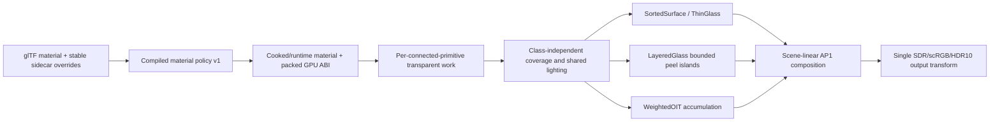

# M6 Hybrid Transparency Execution Plan

## Header

- **Milestone:** M6 — Hybrid Transparency
- **Status:** Approved. M6.0-M6.6 are complete; M6.7 is the active slice.
- **Lead:** current M6 milestone-lead task
- **Last updated:** 2026-08-24
- **Source audit revision:** `b7d10e3f9c8ea263a49f24f0dc11d8a839da1647`
  on `Render-Refactor-for-Modularity`
- **Dependencies:** accepted M0-M5, including M5.12 reflection-resolution
  stabilization and M5.13 shadow-direction/quality hardening
- **Governing ADRs:** ADR-0001, ADR-0002, ADR-0005, ADR-0006, ADR-0007,
  ADR-0008 as superseded by its recorded M5.13 numerical policy, ADR-0009,
  ADR-0010, ADR-0011, and ADR-0012
- **M6 architecture record:** accepted ADR-0012, *Versioned transparency transport
  and bounded execution*. It refines ADR-0005; it does not supersede its classified
  hybrid direction.
- **Approval:** the owner approved this plan and all nine recorded decisions on
  2026-08-13. Implementation proceeds one vertical slice at a time.

## Objective and user-visible outcome

M6 replaces the two-bucket glass bridge with deliberately classified transparency.
When accepted, ordinary windows, lenses, decals, blended surfaces, and effects render
predictably in scene-linear AP1; marked nested glass receives bounded accurate layer
handling; particles can use stable approximate OIT; and all paths retain the shared
M5 lighting, shadow, environment, probe, normal, and BSDF contracts.

The visible outcome is glass that preserves etched headlamp detail, rough reflection,
metric absorption, Fresnel response, and stable coverage without black, white, flat,
or disappearing regressions. The execution outcome is deterministic per-primitive
work, one conditional HDR refraction pyramid, bounded layers and overflow, safe
resize/lifetime behavior, and measured native-4K costs.

## Current context

### Audit scope and worktree

The audit read the required project, roadmap, plan, frame-budget, handoff,
acceptance, performance, and ADR records completely, plus accepted ADR-0003,
ADR-0004, and ADR-0011. It reinspected source-material ingestion, glTF cooking,
compiled/cooked/runtime products, GPU packing, queue extraction, RHI submission,
Vulkan graph execution, shaders and shared includes, descriptors, resize paths,
editor diagnostics, profiler counters, and all configured tests.

The worktree was clean before the audit. Generated build and benchmark output is
under `out/`; this document is the only tracked file changed in the planning phase.
No commits were created.

### Exact current material-to-pixel flow

1. `GltfModelImporter` reads glTF alpha mode/cutoff/double-sided state and the
   transmission, IOR, volume/thickness, attenuation, dispersion, diffuse
   transmission, specular, normal, roughness, metallic, and emissive inputs into
   `SourceMaterial`.
2. `MaterialCompiler` produces a schema-1 `CompiledMaterial`. Alpha blend selects
   forward; active thin/volume/diffuse-transmission lobes select complex forward.
   There is no transport class, author priority, or quality policy.
3. `CompiledMaterialProduct` and cooked-model schema 3 retain the compiled material,
   its texture bindings, material GUID, and source key. `PackedGpuMaterial` schema 2
   is 832 bytes and retains the material/lobe/texture truth but no transparency
   policy.
4. The current cooker emits one cooked primitive per source glTF primitive. Each has
   a stable primitive GUID, stable material GUID, coverage, source locator, AABB,
   sphere, and index range. It does not merge different source primitives by
   material. It also does not prove or split connected components within a single
   source primitive.
5. `ModelRuntimeProduct` publishes each cooked primitive as one `SubMesh` and keeps
   its primitive GUID, material GUID, bounds, and source indices. A blended or
   transmitted material gets a blend-enabled, depth-test/no-depth-write complex
   forward pipeline.
6. `Application::drawFrame` infers the three-value `RenderQueue` from pipeline state.
   It creates a 144-byte `DrawPacket`, transforms the primitive sphere, and retains
   the entity UUID, but drops the primitive GUID, material GUID as stable identity,
   AABB/depth interval, class, and author priority. It calculates one distance from
   the model/entity origin and copies that same value into every submesh packet.
7. Transparent packets are sorted with unstable `std::sort`: origin distance
   descending, then transient pipeline, material, and geometry handles. Equal keys
   have no stable persistent tie.
8. `IRenderBackend::submitForwardQueues` receives only forward-opaque and transparent
   spans. `VulkanVertexBackend` renders forward opaque, then assigns the final
   transparent packet to a foreground bucket and every other packet to a background
   bucket.
9. Each nonempty bucket copies the full `RGBA16F` lit scene into the same aliased
   `scene.opaque-copy`, clears and writes one cull-none D32 `depth.glass` target, and
   shades transparent packets. Thus the Alfa Romeo fixture executes two full-size
   copies, two glass-depth passes, and two forward passes. Only one copy allocation
   exists, but it is overwritten twice.
10. `complex_material_body.glsl` uses the shared material decode, normal mapping,
    clustered direct lights, independent scalar shadows, environment IBL, local
    probes, and shared BSDF functions. Its legacy transport reconstructs depth with
    hardcoded 0.1/100 m, uses only the nearest glass depth, adds 0.02 m, forces a
    minimum volume multiplier of one, uses empirical screen offsets, clamps UVs to
    the edge, and substitutes `-view` on total internal reflection. It straight-alpha
    blends `max(alpha, transmission)` into the scene-linear `litScene`; the one final
    output transform follows.

### Current graph, depth, descriptors, and lifetime

- `scene.color` is scene-linear `RGBA16F`. `scene.opaque-copy` is one logical
  `RGBA16F` resource that aliases an expired GBuffer slot. `depth.glass` is D32.
- Opaque passes write main depth. Transparent pipelines have depth writes disabled,
  but the shared forward render pass loads/stores the main depth attachment and the
  graph conservatively declares `DepthAttachmentWrite`. M6 should split the
  transparent declaration into read/test-only access so it does not create a false
  depth version. Glass-depth passes write only `depth.glass`.
- Frame targets and scene descriptors are rebuilt from graph-owned views. Scene
  viewport resize waits all frame fences before rebuilding; swapchain recreation
  waits the device. This is safe but coarse. Transparency objects currently do not
  cache the glass views.
- The existing scene-viewport API rejects extents below 64 pixels and swapchain
  minimization waits for nonzero size. M6 needs an explicit zero/minimized
  no-allocation/no-submission state in addition to ordinary graph recompilation.
- Probe capture submits opaque and complex-forward opaque queues only. Transparent
  objects are excluded today, preventing recursive or incomplete refraction from
  entering published scene probes.

### Confirmed handoff statements

- The two-bucket implementation, last-packet foreground split, nearest-face depth,
  and one or two full-resolution copy behavior are exactly as described.
- `DrawPacket` loses primitive identity and sorts transparent submeshes using one
  model-origin distance.
- The current glass path is not depth peeling, paired thickness, nesting, or cycle
  resolution.
- Transparent forward uses the shared clustered lights, independent scalar shadow
  visibility, material/normal libraries, cooked environment, and general local
  probe path in scene-linear AP1.
- The 0.1/100 m and 0.02 m shader constants are production behavior.
- M5.12 Ultra environment residency is exactly 108 MiB above the earlier product;
  M5.13 reserves 512 MiB directional plus 592 MiB local shadow memory, 1,104 MiB
  total.
- The test count remains 69 in both configurations.

### Stale, contradicted, or incomplete documentation assumptions

- `PROJECT_CONTEXT.md` line 22 still says import-time merge-by-material can join
  disconnected transparent surfaces, while its later accepted-history section says
  merge-by-material cooking is gone. Current source confirms the latter: distinct
  source primitives remain distinct. The remaining risk is disconnected components
  authored inside one source primitive.
- Earlier observations of a roughly 112-byte packet are stale. `DrawPacket` is 144
  bytes and now has a world sphere, but still lacks primitive GUID/AABB/class.
- The handoff's broad shared-probe statement is incomplete for one term. General IBL
  uses the accepted environment/local-probe selection, but the transport-specific
  Fresnel reflection directly samples the cooked global prefiltered texture. It
  bypasses local probe choice, box correction, environment rotation/intensity, and
  split-sum BRDF handling. It is not a raw source HDRI, but it is still a separate,
  inconsistent transport reflection path to remove.
- The active asset viewer supplies its orbit view/projection/position, but lighting
  and cluster submission still receive the application camera's near/far and FOV.
  This can make transparent depth reconstruction and cluster slicing disagree with
  the displayed preview camera.
- The requested matched "Ultra tiles" premise is not true for the current Alfa Romeo
  fixture. The project profile defaults to Ultra, but generated sample-car lights
  retain `LightShadowQuality::High`; `effectiveShadowFilterProfile` takes the lower
  value. Fresh capture metadata therefore reports 12 blocker/24 filter samples, not
  Ultra's 24/48. The dedicated M5.13 contact fixtures explicitly set Ultra. M6.0 must
  make the M6 comparison fixture explicit and rerun it before M6.1 rendering changes.
- The current glass-depth pass has no fragment/material binding, so it cannot honor
  alpha coverage or thickness textures. Cull-none plus `LESS` stores the nearest
  face; rendering both face orientations does not create a paired thickness.
- There was no post-M5.13 five-process dressed-car baseline before this audit. The
  accepted M5.11 numbers use the older environment and shadow capacities.

### Frozen behavior and missing tests

- `StandardMaterialShadingTests` freezes shared shader includes and the exact
  `outputAlpha = max(alpha, transmission)` bridge.
- `SceneColorTests` freezes scene-linear composition and the single output boundary.
- `VulkanRenderGraphExecutorTests` freezes 22 passes, 26 logical resources, 18
  physical slots, the foreground/background pass names, the copy/GBuffer alias, and
  resize cleanup.
- Material/source/runtime/product tests freeze schema and packed-record behavior;
  model/importer tests freeze stable primitive GUIDs, per-primitive bounds, coverage,
  and one-to-one runtime publication.
- Profiler and M5 fixture tests freeze the legacy bucket counter names and historical
  shader/SPIR-V hashes. Updates must be explicit supersessions after behavior tests
  pass, never blind regeneration.
- There is no test for deterministic transparent ties, interval sorting, glass-depth
  material coverage, active-viewer camera transport, layered overflow, or OIT error.

## Fresh post-M5.13 pre-correction baseline

### Method

- Hardware: RTX 4090, i9-14900K, 64 GB; NVIDIA driver 610.74; Vulkan 1.4.341.
- Revision: `b7d10e3f9c8ea263a49f24f0dc11d8a839da1647`.
- Release, native 3840x2160, validation off, five fresh processes, 500 warmups and
  10,000 retained frames each, no reconstruction, PCSS, 4096 directional maps,
  8192 spot atlas, current point pools, current two-bucket path.
- Fixture: `sample_car_lighting_local_v1`, deterministic three-light camera, accepted
  cooked car, and M5.12 `belfast-ultra-v3.irartifact` (cook key
  `e36228c3607935c0dd00e5f401803a738dcdadbed069ef4504c5e24d27a2143a`).
- Transparent pipeline statistics were enabled. The fixture contains 118 primitives:
  101 deferred, 12 forward opaque, and 5 transparent.
- Evidence: `out/benchmarks/m6.0-post-m5.13/car-ultra-r1.jsonl` through `r5.jsonl`.
  The filename's “ultra” accurately identifies the environment/project setting, but
  the per-light High cap described above applies.
- Debug native-4K Vulkan-validation captures used the same inputs and current
  effective shadow quality. No validation messages were emitted.

### Results

| Metric | Fresh current-source result |
|---|---:|
| CPU frame median of medians | 4.8951 ms |
| CPU worst p95 / p99 | 5.1959 / 5.3284 ms |
| GPU frame median of medians | 4.596640 ms |
| GPU worst p95 / p99 | 4.856192 / 4.930848 ms |
| transparent sort median / worst p99 | 0.0001 / 0.0004 ms |
| GBuffer median | 0.123904 ms |
| cluster assignment median | 1.927936 ms |
| probe-cluster assignment median | 0.005120 ms |
| deferred lighting median | 0.342016 ms |
| complex/forward-opaque median | 1.628160 ms |
| two copy passes, summed medians | 0.103424 ms |
| two glass-depth passes, summed medians | 0.020480 ms |
| two transparent-forward passes, summed medians | 0.231424 ms |
| compatibility transparency, summed medians | 0.355328 ms |
| transparent fragment invocations | 2,701,167 (0.325662 full-screen equivalents) |
| requested live / peak | 2,176.982 / 2,379.977 MiB |
| committed live / peak | 2,247.056 / 2,450.052 MiB |
| graph requested / committed | 860.639 / 930.483 MiB |
| environment residency | 137.276 MiB |
| directional / local shadow reservation | 512 / 592 MiB |
| C++ calls / requested bytes per retained frame | 39 / 5,288 |
| dropped frames / CPU detail overflow / GPU detail overflow | 0 / 0 / 0 |

Against M5.11, current requested and committed live memory are each exactly 684 MiB
higher: +108 MiB environment, +384 MiB directional shadow, and +192 MiB local
shadow. Peak is 792 MiB higher because the larger environment upload adds another
108 MiB of transient staging. GPU median is 0.358208 ms higher and complex-forward
is about 0.379 ms higher; this comparison is contextual, not an M6 regression, since
M5.12/M5.13 changed inputs and capacity.

The steady shadow maps are cache hits after warmup, so retained frames contain no
shadow-render update range. Shadow *sampling* is included in deferred and forward
consumer timings and is not separately attributable with current timestamps.
Reflection sampling is likewise inside those consumers; only probe-cluster assignment
has its own 0.005120 ms range.

Validation captures:

- scene-linear AP1 PFM SHA-256:
  `c4249ad67f32f6e275868e75614e5e68d3417f7f14771d5ca771a39048b4f523`
- final SDR TGA SHA-256:
  `43ac90777f633ba48b20a86a5be3b6207537e83f4c341216b379e787a2941f71`
- evidence directories: `out/benchmarks/m6.0-post-m5.13/validation-scene/` and
  `validation-final-sdr/`

This audit baseline is retained to explain the quality discrepancy; it is not the M6
comparison baseline.

## Corrected M6.0 Ultra baseline

M6.0 explicitly sets all shadowed sample-car fixture lights to Ultra. Debug native-4K
capture metadata confirms 24 PCSS blocker samples, 48 filter samples, a 4096
directional resolution, and one directional owner. The Khronos validation layer
reported no messages.

The accepted Release profile set is
`out/benchmarks/m6.0-ultra-baseline/profiles/car-ultra-r3.jsonl` through `r7.jsonl`.
Runs `r1` and `r2` remain in the evidence directory but are rejected as nonstationary:
their GPU p95/p99 values were 92.027168/163.155616 ms and
54.921216/100.309216 ms. Five subsequent fresh processes are tightly grouped and
form the frozen comparison set.

| Metric | Corrected Ultra result |
|---|---:|
| CPU frame median of medians | 15.8230 ms |
| CPU worst p95 / p99 | 16.1916 / 16.5288 ms |
| swapchain acquire median of medians | 15.0629 ms |
| GPU frame median of medians | 6.092096 ms |
| GPU worst p95 / p99 | 7.901888 / 8.375680 ms |
| cluster / deferred / forward-opaque medians | 1.928704 / 0.575488 / 2.548736 ms |
| compatibility transparency, summed median | 0.448512 ms |
| transparent fragment invocations | 2,700,703 (0.325606 full-screen equivalents) |
| requested live / peak | 2,176.982 / 2,379.977 MiB |
| committed live / peak | 2,247.056 / 2,450.052 MiB |
| graph requested / committed | 860.639 / 930.483 MiB |
| C++ calls / requested bytes per retained frame | 39 / 5,288 |
| dropped frames / CPU detail overflow / GPU detail overflow | 0 / 0 / 0 |

The CPU frame total is display paced: `VK_PRESENT_MODE_MAILBOX_KHR` image acquisition
accounts for 15.0629 ms of the 15.8230 ms median. Renderer budget decisions therefore
use the GPU ranges and the separately recorded CPU work ranges, not this paced total.

Corrected validation capture SHA-256 values:

- scene-linear AP1 PFM:
  `484dac9fc58c69448bc1883a45b90759459a62d1ea74d96758aa78a33e62705d`
- final SDR TGA:
  `f9f97f18a2f373e5b09dfdba4acd458e584da2656cf10d4edeb88f47d7955bb4`
- evidence root: `out/benchmarks/m6.0-ultra-baseline/`

Debug and Release builds pass 70/70 tests. The complete deterministic fixture matrix,
fixed cameras and identities, analytic transport oracle, capture contract, required
counters/ranges, input hashes, and corrected baseline are frozen under
`assets/benchmarks/m6/`.

## Invariants

- All transparent lighting, reflection, refraction, absorption, emissive, OIT, and
  composition remain scene-linear ACEScg/AP1 until the one final output transform.
- Deferred, forward opaque, sorted, thin, layered, OIT, and future ray paths share
  the material/normal/BSDF, clustered-light, scalar-shadow, environment, and local
  probe contracts. No glass-only lighting or probe system is permitted.
- Local `+Z` remains the authored light-emission direction. M5.13 ownership,
  no-stale-publication, visibility-one fallback, and current numerical shadow policy
  remain intact.
- One world unit is one metre for transport after instance transforms. Geometric
  normal, shading normal, refraction normal/direction, transport depths, material
  thickness, and shadow receiver bias are separate quantities.
- Stable entity, primitive, material/subasset, and connected-subprimitive identities
  are used for persistent work. Handles, queue indices, pointers, and ECS indices are
  not identities.
- Disconnected transparent components are never merged merely because they share a
  material.
- New resources and descriptors are graph/frame-context owned, declare access and
  lifetime, and survive resize, minimize, output transport, and capture insertion.
- Unsupported, invalid, off-screen, missing-resource, and overflow cases produce a
  deterministic bounded fallback and a diagnostic; never memory corruption, random
  flicker, silent missing draws, black samples, or stale publication.
- M6 does not pull in M7 GPU-scene/visibility work, M8 mesh shaders, M9 temporal
  filtering, M10 colored-shadow products/GI/atmosphere, M11 ray tracing/path tracing,
  bloom, or caustics.

## Scope and non-goals

In scope are versioned classification, stable primitive work, deterministic sorted
surfaces, active-camera metric transport, thin and closed-volume glass, a conditional
scene-color/depth pyramid, bounded depth-peeled layers, weighted blended OIT,
authoring/diagnostics/profiling, graph lifetime, comparison fallback, fixtures, and
qualification.

M6 defines visible-surface RGB transmittance, absorption, thickness, and coverage so
M10 can later consume them for colored raster shadows. M6 continues to *receive*
existing scalar shadows. It does not tint scalar shadow maps, implement colored
shadow storage, indirect lighting, or claim caustics.

## Design and data flow



### Classification is separate from execution phase

Introduce backend-neutral `TransparencyClass` and keep it distinct from coverage
and execution. `CoverageMode` remains opaque/mask/blend. A resolved class can route
to different execution phases based on closure and capability; `AlphaClip`, for
example, can remain deferred or use forward opaque. Replace source-facing expansion
of the current `RenderQueue` with an internal `RenderPhase` such as opaque,
forward-opaque, transparent-sorted, layered-capture/composite, and OIT
accumulate/composite.

The source contract is `TransparencyPolicyV1`: Auto or explicit class, quality tier,
signed author priority, and optional thin-sheet thickness in metres. It lives in the
versioned asset metadata settings, keyed by stable material or primitive subasset
GUID, rather than in ImGui or Vulkan state. Old schema migrates deterministically to
Auto. Unknown values diagnose and select a safe fallback.

`CompiledMaterial` and `CompiledMaterialProduct` gain explicit schema versions.
Cooked-model schema and importer version advance because primitive splitting and
policy affect runtime work. Normalized policy participates in CookKeys. The existing
12 reserved bytes in the 832-byte packed record can carry resolved class/quality/
flags and thin thickness while keeping stride stable, but its ABI schema still
advances deliberately. Product readers reject unsupported new schemas; old source
recooks through Auto.

### Recommended class contract

| Class | Contract |
|---|---|
| `AlphaClip` | Non-transmissive binary coverage. Alpha cutoff is evaluated in depth, color, shadow caster, selection, and capture paths. It depth-writes in deferred or forward opaque, needs no transparent ordering/refraction, receives ordinary lighting/shadows, and exposes discarded-fragment counters. A transmissive masked material uses Thin/Layered plus orthogonal mask coverage rather than losing transport. |
| `SortedSurface` | Low-cost non-refractive alpha-blended surfaces where primitive back-to-front order is sufficient: decals, simple foliage cards, UI-like world surfaces, and conventional blended materials. It depth-tests read-only, does not write depth, uses premultiplied scene-linear composition, receives shared lighting/scalar shadows, and has no volume/dispersion. Ambiguous intersections remain deterministic and diagnosed; explicit priority or another class is the remedy. |
| `ThinGlass` | An infinitesimal air/material/air sheet with shared Fresnel/reflection/transmission. Default thin thickness is 0 m, producing no fabricated screen displacement or absorption. An explicit nonnegative effective sheet thickness enables metric Beer-Lambert and bounded refraction footprint; it is not geometry thickness. It depth-tests read-only, sorts deterministically, uses the HDR pyramid/probe fallback, receives scalar shadows, and never manufactures entry/exit depths. |
| `LayeredGlass` | Valid orientable closed components with paired front/back interfaces. It uses measured metric chords bounded by the authored thickness field, a bounded medium stack, exact interface ordering, shared lighting, and the HDR/layer pyramids. Invalid topology falls back to ThinGlass with diagnostics. Quality is 2, 4, or 8 stored interfaces; overflow is deterministic and visible. |
| `WeightedOIT` | Explicit approximate class for non-refractive particles/high-overdraw effects. It supports alpha coverage, shared lighting, emissive, opaque-depth testing, and scalar shadow receiving, but forbids specular transmission, volume, dispersion, screen refraction, and order-critical absorption. Incompatible explicit requests diagnose and fall back to SortedSurface. |

Auto resolves non-transmissive Mask to `AlphaClip`, non-transmissive Blend to
`SortedSurface`, zero-thickness transmission/diffuse transmission to `ThinGlass`, and
positive-volume material to `LayeredGlass` only when connectivity/manifold validation
succeeds. Invalid positive volume falls back to ThinGlass while preserving the
authored effective thickness and emitting a high-severity diagnostic. Auto never
selects WeightedOIT; author intent is required.

### Stable transparent work and sorting

For transparent source primitives, cooking identifies triangle connected components
without merging them. Components are ordered by the lowest original triangle index;
their stable subprimitive ID is derived from primitive GUID plus that canonical
source-triangle seed. Geometry/index records may be split so every work item has an
exact contiguous range and exact local AABB/sphere. Model schema and CookKey changes
are required.

`TransparentWorkIdentity` combines scene entity UUID, source primitive GUID, stable
connected-subprimitive ID, and effective material GUID. `TransparentWork` also
carries exact world AABB/sphere, mirrored-transform sign, coverage, class/tier,
signed priority, and backend-neutral material/geometry references. This is compatible
with M7 but remains CPU-extracted in M6.

The active camera transforms all eight AABB corners. Positive view-depth interval is
clipped to the active near/far range. At a given priority, non-camera-intersecting
work sorts before camera-intersecting work, then by far depth descending, near depth
descending, and stable work identity ascending. Priority is ascending so larger
author priority composites later/on top. A stable sort is used and no transient
handle participates in the final tie.

An interval sweep counts overlapping/ambiguous pairs without claiming to solve
per-pixel cycles. Identical intervals remain stable by identity. Near-plane crossing
clamps the near end and sets a diagnostic flag. Mirrored transforms correct
orientation/tangent handedness without changing bounds. Fully behind-camera/outside
range work is culled. Invalid/missing/nonfinite bounds fall back to deterministic
late SortedSurface work with refraction disabled, never to a random key or silent
drop. Intersections/cycles needing accuracy must use LayeredGlass or content
priority; SortedSurface's limitation is explicit.

### Active-camera and metric transport

Add one backend-neutral per-view transport record containing view/projection and
inverses, camera position, real near/far, projection kind, render extent, and
metres-per-world-unit (=1). Both the scene camera and isolated asset viewer populate
the same record. Depth reconstruction uses inverse projection; near/far are used for
range validation and must equal the cluster inputs. This removes all shader camera
constants and fixes the viewer mismatch.

For Beer-Lambert, attenuation distance is in metres and attenuation color is the
transmittance after that distance. Per-channel extinction is
`-log(clamp(color))/distance`; infinite distance means zero extinction. Inputs are
bounded and diagnosed rather than producing NaN/Inf.

For ThinGlass, optional authored sheet thickness is transformed to world metres and
divided by a bounded incidence cosine. With zero thickness, absorption and lateral
screen offset are zero while Fresnel reflection/transmission remain.

For LayeredGlass, depth peeling stores metric entry/exit interface depth, work ID,
and face orientation. The measured same-work opposite-face chord is authoritative
geometry. The glTF thickness factor times texture green is a maximum normal material
thickness; after instance scaling and incidence projection it caps the participating
path. A large disagreement between authored cap and closed geometry is diagnosed.
This uses authored texture/factor without multiplying two unrelated lengths.

Geometric normal controls face orientation, medium-stack entry/exit, pairing, and
path length. The shared normal-mapped shading normal controls BRDF reflection. A
sanitized low-frequency transmission normal may perturb refraction but is oriented
to and angularly bounded around the geometric normal; it never moves depth,
thickness, or shadow receivers. IOR is air/material for thin sheets and the current
bounded medium stack for layers. Total internal reflection uses the reflected ray
and zero transmitted energy, not `-view`.

The temporary `max(alpha, transmission)` expression is removed only after a
premultiplied energy/coverage model passes matched headlamp normal, ridge, roughness,
Fresnel, HDRI/probe, transmission, and silhouette tests. Coverage remains distinct
from optical transmittance so already-composited light cannot be blended away.

### One HDR scene pyramid and off-screen behavior

After deferred lighting and opaque-complex forward, and before any transparency, the
graph conditionally snapshots `litScene` into one `RGBA16F` full mip chain. It is
built only when ThinGlass or LayeredGlass needs screen refraction. A conditional
`R32_SFLOAT` conservative nearest-view-depth mip chain accompanies it for
depth-discontinuity rejection. The ordinary sorted and OIT paths do not force either
resource.

Roughness maps to a bounded GGX transmission-cone footprint; IOR and metric path
length determine the projected offset/footprint, and trilinear mip selection follows
`log2` footprint. Depth-conservative samples that cross a nearer opaque discontinuity
retry a finer mip and then fall back. UVs are never simply clamped to stretch edge
colors.

Invalid/off-screen/missing screen samples blend over a footprint-dependent edge band
to the accepted global/local-probe environment transport along the refracted ray,
including authored absorption. Counters and a debug view show fallback ratio. A
missing pyramid selects probe/environment transport, not black.

Sorted/Thin work sees the frozen opaque-plus-opaque-complex snapshot, not feedback
from previously blended global transparent work. Within one LayeredGlass island,
back-to-front layer composition updates a bounded local color atlas and rebuilds only
dirty tile mips, so a front interface can refract already-composited interfaces
behind it. This distinction is explicit in diagnostics and fixtures.

At 4K the color chain is 84.4 MiB and the depth chain 42.2 MiB before alignment per
frame context. Color construction moves about 168.8 MiB and depth construction about
84.4 MiB per active frame, excluding cache effects. Both resources are graph-owned,
conditional, captureable, and alias only with nonoverlapping compatible lifetimes.

### Bounded layered glass

Use bounded front-to-back depth peeling of **interfaces**, not objects. Tiers are
`Ordinary2` (one closed shell), `Hero4` (two nested shells), and `Cinematic8`.
Project quality is a cap; content may request less. Empty/opaque tiles terminate
early.

Projected bounds are rounded to 16x16 tiles and overlapping bounds form deterministic
screen-space islands. Each island uses a packed rectangular atlas allocation and
viewport offset, avoiding full-screen peel storage for small hero glass. Every peel
slice stores D32 plus R32 work/orientation identity. Color shading is rerasterized in
reverse slice order against the stored depth/ID, saving large per-layer material
records. The bounded local AP1 atlas and dirty mips allow front layers to see back
layers. Material alpha/mask coverage is evaluated in peel capture; the current
vertex-only glass-depth behavior is not reused.

At full 4K, D32+R32 costs 63.3 MiB per interface: 126.6/253.1/506.3 MiB for 2/4/8,
plus a 63.3 MiB full-size color atlas. Physical cost scales with packed island area;
ordinary execution is capped initially at 25% of screen, Hero4 at 50%, and only an
explicit Cinematic8 profile may request full screen. The cap itself is an approval
decision and will be tuned from measured fixtures.

When fragments exceed the interface limit or area budget, the stored exact prefix
remains valid and the residual is composited as a non-refractive weighted
transmittance/reflection tail in the final stored layer. Overflow never allocates
more nodes or silently drops the surface. Requested/stored/rejected interfaces,
overflow pixels, residual energy, island area, early termination, and fallback class
are counted and heatmapped. Invalid/nonmanifold topology falls back to ThinGlass;
unsupported device/format capability falls back to ThinGlass with probe-only
refraction.

An unbounded per-pixel linked list was rejected because memory, atomics, overflow,
and 4K behavior are not bounded. Dual depth peeling was considered; it reduces pass
count in some cases but complicates stable work pairing and front-layer refraction.
The recommended sequential bounded peel is simpler to validate and scales by an
explicit interface cap.

### Weighted OIT

Use weighted blended OIT with `RGBA16F` accumulation and `R16F` revealage. Each
fragment contributes premultiplied scene-linear radiance and coverage using a
bounded alpha/depth weight (initially [0.01, 8]); revealage multiplies `(1-alpha)`.
Resolve divides accumulated RGB by accumulated alpha weight and composites with
`1-revealage`. Emissive is coverage-weighted; additive-only particles remain a
separate future policy rather than abusing alpha.

The 4K targets cost about 79.1 MiB per frame context before alignment. Clears plus
resolve move at least roughly 158 MiB, while fragment blend bandwidth scales with
actual overdraw. Bounds/scissors and tile counters are used when effect bounds exist.
FP16 saturation/underflow is counted; controlled HDR fixtures compare against an
FP32 CPU/offline reference. If FP16 error is unacceptable, the alternative is a
measured optional FP32 accumulation tier, not silent clamping.

WeightedOIT cannot carry refraction, volume, dispersion, order-critical colored
absorption, or hero glass. Incompatible material features fall back to SortedSurface
and diagnose. OIT depth-tests the read-only opaque depth, never writes it, and retains
shared lighting/probe/scalar-shadow receiving.

### Reflection probes, shadows, and future contracts

All transport reflection calls the accepted shared scene-specular API so environment
rotation/intensity, BRDF integration, bounded sphere/box probe selection, blending,
box correction, complete-only publication, and missing-resource fallback apply.

Transparent surfaces remain excluded from scene-probe capture in M6 production.
This avoids recursion and captures only stable opaque/opaque-complex radiance. The
exclusion is explicit in capture metadata and diagnostics. Assigned/cooked probes
and last-known-good complete scene probes continue to illuminate transparency. A
later milestone may define bounded inclusion with revision recursion control; M6
does not silently change publication.

Visible transport exports unambiguous RGB transmittance/extinction, metric thickness,
and coverage semantics for M10. It does not color existing scalar visibility or
claim direct-light colored transmission/caustics.

### Graph, descriptor, resize, and retirement policy

Pyramids, peel arrays/atlases, OIT targets, tile lists, and compatibility resources
are render-graph declarations with explicit read/write states. Transparent access to
main depth is read-only. Descriptors are rebuilt from the owning frame context after
graph compile and are retired with that context's fence; longer-lived pipelines and
transparency managers store logical handles/configuration, never cached graph views.

Extent or class/tier changes compile a candidate graph, stop submission for zero or
minimized extent, and publish the candidate only after current owning frames retire.
Failed candidates leave the last valid graph active when an extent is renderable.
Swapchain output changes may retain the existing device-idle safety path, but scene
viewport resources use frame-context retirement rather than introducing new global
stalls. Capture insertion declares its transitions through the graph.

### Profiling and scratch

Add per-class input/rendered/fallback counts, sort input/cost/ambiguous intervals,
invalid bounds/topology, projected pixels/tiles, copy/pyramid bytes and mip work,
fragment invocations, requested/stored/rejected layers, early termination, overflow,
OIT saturation/revealage, per-pass GPU timestamps, class lighting cost, graph logical
and aliased bytes, descriptor retirements, validation messages, and profiler drops.

New queues, sort keys, islands, tiles, and layer scratch are persistent per-frame
context buffers. Every slice must add zero steady per-frame allocations. M6.8 targets
removal of the inherited 39-call/5,288-byte debt; final acceptance requires either
zero or a measured, bounded, owner-approved exception.

### Estimated native-4K budget before implementation

These are engineering estimates, not acceptance claims:

| Work | Expected GPU cost | Logical memory / bandwidth notes |
|---|---:|---|
| SortedSurface only | 0.10-0.35 ms at current coverage | no pyramid; scales with fragments |
| conditional color+depth pyramids | 0.15-0.30 ms | 126.6 MiB/frame context; about 253 MiB construction traffic |
| ordinary ThinGlass including pyramid | 0.45-0.90 ms | intended to fit the provisional 1.0 ms ordinary budget |
| Layered Ordinary2 at <=25% screen | +0.4-0.9 ms | about 47.4 MiB peel/color atlas plus shared pyramids |
| Hero4 at <=50% screen | +0.8-1.8 ms | separate marked hero budget |
| Cinematic8 worst case | +1.5-3.5 ms | explicit offline/cinematic profile; never ordinary default |
| WeightedOIT around 1x fullscreen equivalents | 0.25-0.65 ms | 79.1 MiB/frame context; overdraw-bound |

Two frame contexts double concurrently allocated nonaliased image totals. Classes can
coexist, so aliasing is claimed only where graph lifetimes really do not overlap.
The M6.4-M6.7 slices must replace estimates with requested/committed allocation,
bandwidth proxies, timestamps, fragment counts, and image evidence.

## Meaningful architecture choices

| Choice | Recommendation | Alternatives and implications | Validation |
|---|---|---|---|
| Class vs queue | Versioned class, orthogonal coverage, derived execution phase | Expanding `RenderQueue` conflates author intent with backend scheduling and blocks future visibility/RT paths | source/cook/runtime round trips; backend-neutral architecture tests |
| Authoring location | Stable sidecar policy keyed by material/primitive GUID | Mutating glTF is fragile; editor-only or Vulkan enum loses headless cook/runtime truth | migration, unknown-field, reimport, CookKey, diagnostics tests |
| Sorting | AABB view intervals + priority + stable identity | Center/sphere distance is cheaper but fails large/disconnected surfaces; full per-pixel ordering is too costly for ordinary content | property tests, camera crossings, mirrored/invalid/tie/cycle fixtures |
| Thin thickness | Zero by default; explicit metric effective sheet thickness | Arbitrary constant looks plausible but is physically ungrounded; forcing every sheet closed is impractical | CPU Snell/Beer math, 0/metric sweeps, headlamp captures |
| Volume thickness | Paired measured chord capped by authored field | Authored-only ignores geometry; multiplying chord by authored metres is dimensionally wrong | closed-shell analytic scenes, texture sweeps, nested reference images |
| Rough refraction | One conditional AP1 pyramid + conservative depth chain + probe fallback | Per-layer full copies scale badly; UV clamp stretches edges; probe-only loses local scene refraction | edge/off-screen/discontinuity/roughness captures and timings |
| Layering | Bounded interface peeling in packed islands, 2/4/8 | PPLL is unbounded; global fixed arrays waste 4K memory; dual peel complicates identity pairing | nested shells, overflow, coverage, island packing, resize stress |
| OIT | FP16 weighted blended, bounded weights, strict class restrictions | Exact sorting flickers/high CPU at particle scale; PPLL is unbounded; FP32 costs ~2x and is optional only if evidence requires | randomized reference orders, HDR/overdraw sweeps, saturation counters |
| Probe capture | Explicitly exclude transparency in M6 | Including it risks recursion/stale publication; probe-only lighting remains available | capture metadata, revision/last-known-good tests |
| Compatibility | Named nondefault `LegacyTwoBucket` developer A/B mode through qualification | Immediate deletion weakens rollback; silent fallback would hide defects | matched captures/timings and forced fallback tests |

## Vertical slices

Only one slice may be `In Progress`.

### M6.0 — Audit, deterministic fixtures, and post-M5.13 baseline — `Completed`

- **Preconditions/systems:** current plan, benchmark manifests, fixture generation,
  profiling/capture; no renderer behavior changes.
- **Behavior:** retain this audit; add the complete transparency fixture matrix and
  reference math/images; set the comparison car lights explicitly to Ultra; freeze
  current class counts, camera, products, M5.13 shadow parameters, captures, and
  five-process protocol.
- **Tests/evidence:** fixture-contract tests, Debug/Release 69+ tests, validation
  scene/final captures, fresh five-process native-4K rerun with Ultra 24/48 effective
  profile, memory/allocation/counter report.
- **Fallback/rollback:** fixtures are additive and current M5 fixtures remain valid.
- **Complete when:** owner approves the plan, all required deterministic cases have
  stable identities/cameras, and the corrected pre-render-change baseline is frozen.

### M6.1 — Versioned class, authoring, cook/runtime contracts, and diagnostics — `Complete`

- **Likely systems:** `AssetMetadata`, `SourceMaterial`, compiler/product/model
  schemas, runtime packing, material diagnostics, CLI/fixture contract, ADR-0012.
- **Behavior:** implement `TransparencyPolicyV1`, Auto resolution, explicit override,
  quality/priority/thin thickness, version/migration/CookKey/unknown behavior, class
  display, and named `LegacyTwoBucket` developer comparison mode. Separate class,
  coverage, and render phase.
- **Tests/captures/perf:** source/cook/product/runtime round trips and deterministic
  hashes; class matrix capture must remain legacy-pixel-identical while all new
  classes execute compatibility fallback; zero incremental allocations.
- **Fallback:** unsupported/unknown policy -> diagnosed Auto/Safe Sorted; legacy mode
  remains selectable and nondefault only after classified routing is ready.
- **Complete when:** all five semantics survive source-to-GPU inspection and ADR-0012
  is accepted without changing pixels.

Completed 2026-08-14. `TransparencyPolicyV1` now carries Auto or explicit class,
2/4/8 quality, signed author priority, and optional metric thin-sheet thickness from
source metadata through compiled-material schema 2, compiled-product schema 2,
cooked-model schema 4, runtime `SubMesh`, and packed-material schema 3. The GPU
record remains exactly 832 bytes: its former 12-byte tail now holds the compiled
policy, while packed-normal Z reconstruction moved to a feature bit. Coverage,
transport class, and the still-legacy execution mode remain distinct contracts.

Auto resolution, explicit incompatibility fallback, closed-topology gating for
LayeredGlass, explicit-only WeightedOIT, schema-1 settings migration, unknown-field
diagnostics, and malformed-type normalization are deterministic and tested. All
five execution semantics survive source-to-GPU packing. A Release recook of the Alfa
Romeo reference preserved the parent GUID and all 281/281 subasset GUIDs, matched all
87 source materials, and published `LegacyTwoBucket` with cook key
`5ee018f14eb94f7d94020705adf50c8d9ea4f9a4282f1598200875dffaad01c2`.

Debug native-4K validation captures are byte-identical to M6.0: scene-linear PFM
`484dac9fc58c69448bc1883a45b90759459a62d1ea74d96758aa78a33e62705d`
and final-SDR TGA
`f9f97f18a2f373e5b09dfdba4acd458e584da2656cf10d4edeb88f47d7955bb4`.
The validation layer emitted no messages. One matched Release 10,000-frame run kept
the exact 39 calls / 5,288 requested bytes median per frame, 860.639/930.483 MiB
requested/committed graph allocation, and 2,176.982/2,247.056 MiB requested/committed
live memory, with zero dropped frames or profiler overflows. Its 6.147776 ms GPU
median and 8.004864/8.420032 ms p95/p99 are observational single-process evidence,
not a new baseline; the fixed execution path and pixel output did not change. Debug
and Release pass 70/70 tests. Evidence is under `out/benchmarks/m6.1-policy/`.

### M6.2 — Stable per-primitive work and deterministic SortedSurface — `Complete`

- **Likely systems:** cooker/model schema, `SubMesh`, `DrawPacket` successor,
  extraction, RHI forward submission, sort scratch/profiler.
- **Behavior:** split transparent connected components, preserve stable IDs/AABBs,
  build active-camera depth intervals, implement priority/ties/invalid behavior, and
  route SortedSurface with premultiplied scene-linear blending/read-only depth.
- **Tests/captures/perf:** connectivity/CookKey tests; sort property/permutation tests;
  disconnected, identical, crossing, mirrored, invalid, near-plane, intersection,
  cycle, camera-cut/motion fixtures; queue/sort CPU and allocations.
- **Fallback:** invalid bounds and unsupported blend use deterministic safe sorted
  work; legacy A/B remains available.
- **Complete when:** repeated processes and input permutations produce identical work
  order/captures and limitations are diagnosed.

Completed 2026-08-20. The implementation advances the glTF importer to version 5 and the cooked
model to schema 5. Transparent triangle edge-connected components are emitted as
independent contiguous raster/RT ranges with exact bounds, original primitive GUID,
and a deterministic connected GUID derived from the lowest source triangle. Runtime
material variants are keyed by stable material GUID plus the exact compiled primitive
policy, preventing primitive overrides from reusing an incompatible pipeline.

The CPU extractor now builds eight-corner active-camera intervals, clips/culls the
positive depth range, records mirrored/near/far/invalid diagnostics, and total-orders
work by priority, camera intersection, far/near depth, and stable identity. An exact
caller-scratch O(n log n) sweep counts ambiguous intervals without steady-state
temporary allocation. SortedSurface has a separate graph pass, read-only main depth,
premultiplied scene-linear blending, mirrored front-face/tangent correction, shared
clustered lighting, per-class counters, and a retained compatibility queue for every
class not yet implemented.

The classified Alfa Romeo reference cooks without diagnostics with cook key
`f953d6dff420967657420ea4101c50866d25cb3b326320abd5900b124835cbab`
and artifact SHA-256
`f9c3e3a2a8e3f2353b8dfeb399b9648b92e4d65b0f69f973ef626e955cbc4ce7`.
Inspection reports schema 5, classified execution, 87 materials, 76 views, and 174
connected primitives from 118 source primitives. The retained smaller cooker probe
still demonstrates byte-identical output across fresh processes.

Two Vulkan defects found during qualification are now fixed. SortedSurface selects
the non-transmissive complex-forward shader, so it cannot statically access the
compatibility scene-copy/glass-depth descriptors before those resources exist. Its
read-only depth render pass also stores main depth for downstream compatibility
draws; the former `STORE_OP_DONT_CARE` made their later depth load undefined. The
classified compatibility queue now keeps stable interval/identity ordering while
`LegacyTwoBucket` retains its frozen M6.1 comparator.

Two fresh Debug native-4K validation processes produced byte-identical scene-linear
AP1 captures with SHA-256
`64275ef416eff21f8f19781d928fdbbbb2221f62178fe9c5e0eb85ee201961a4`.
Two more produced byte-identical final-SDR captures with SHA-256
`c982d799ab1d28b70cdee66a540303afb77c801143ab142dcdf643a042198e46`.
All four processes emitted zero Vulkan validation messages. The frame contains 61
transparent work items: 55 SortedSurface, six classified compatibility fallbacks,
647 ambiguous interval pairs, and no culled, invalid-bound, or near-clipped work.

The deliberate visual change is localized to the Alfa headlamp transparent surfaces.
Against M6.0, final SDR changes 0.874638% of pixels with mean luma SSIM 0.992150;
scene-linear AP1 changes 1.246082% of pixels, remains finite, and has 0.005406 mean
absolute RGB error. The exact historical-equality comparison therefore fails as
expected. Inspection preserves symmetric lens ridges, etched detail, Fresnel
highlights, and transmission clarity; M6.3 retains the stronger dedicated headlamp
parity gate.

The accepted Release native-4K profiles are `car-classified-r1`, `r2`, `r3`, `r6`,
and `r7` under `out/benchmarks/m6.2-sorted/profiles/`. Each used 500 warmups and
10,000 measured frames. Median-of-process GPU frame median is 5.919808 ms versus the
6.092096 ms M6.0 baseline; worst p95/p99 are 7.799392/8.395680 ms versus
7.901888/8.375680 ms. SortedSurface median is 0.176128 ms and all ordinary
transparency ranges sum to 0.472064 ms, below the 1.0 ms allocation. Fragment work is
2,687,995 invocations or 0.324073 fullscreen equivalents. Runs `r4`, `r5`, and `r8`
remain recorded but are rejected for 20.50%, 26.86%, and 11.96% retained-segment GPU
median swings.

Every accepted process retains exactly 39 C++ allocation calls and 5,288 requested
bytes per frame. Graph allocation is unchanged at 860.639/930.483 MiB requested/
committed; the extra graph pass adds two barriers but no physical slot. Connected
component records add only 1,152 requested/committed live bytes and 2,304 peak bytes.
There are zero dropped frames or profiler overflows. Debug and Release both pass
70/70 tests, including connectivity, primitive-policy variants, every sort
permutation, interval/camera/invalid behavior, graph access, and frozen M5 contracts.

### M6.3 — Active camera, thin/volume math, absorption, and headlamp parity — `Complete`

- **Likely systems:** per-view RHI record, scene/viewer cameras, cluster submission,
  shared BSDF/transport includes, complex forward shader/tests.
- **Behavior:** remove hardcoded camera/thickness/TIR behavior; add inverse-projection
  depth, ThinGlass metric semantics, shared Fresnel/reflection, Beer-Lambert, normal
  separation, and energy/coverage composition. Closed volume remains safe ThinGlass
  fallback until peeling lands.
- **Tests/captures/perf:** CPU/GPU math parity, finite/extreme inputs, IOR/thickness/
  attenuation/normal/roughness sweeps, asset-viewer range test, Alfa windows and
  etched headlamp scene/final/HDR captures, strong side lights and probes.
- **Fallback:** no pyramid -> zero-offset/probe transport; invalid volume -> Thin.
- **Complete when:** no 0.1/100 or 0.02 production constants remain and headlamp
  detail is preserved or improved by measured image criteria.

M6.3 closes with one backend-neutral 320-byte `ViewTransportRecord` used by both
the scene camera and the isolated asset viewer. It carries view/projection and both
inverses, camera position, the active near/far range, projection kind, render extent,
and metres-per-world-unit. The viewer's live near/far/FOV now also drives transparent
interval extraction, clustered lighting/probes, and directional-shadow cascades, so
the renderer no longer mixes viewer projection with application camera constants.
The per-frame Vulkan UBO grows by 192 bytes per frame context (384 bytes total).

`TransparencyTransport.h` and the matching GLSL include freeze exact unpolarized
dielectric Fresnel with total internal reflection, bounded Beer-Lambert extinction,
and metric ThinGlass incidence paths. Geometric normal controls transformed sheet
scale and path length while the normal-mapped shading normal remains the reflection
interface. Zero authored sheet thickness returns exactly zero absorption path and
M6.3 uses the declared zero-offset scene sample until M6.4 owns the HDR pyramid.
LayeredGlass can use its authored volume cap as a safe thin-sheet bridge; genuine
entry/exit chords remain M6.5 work. The compatibility coverage expression remains
separate from optical transmittance as required by the approved headlamp gate.
All former production `0.1/100`, `+0.02`, `0.12`, and roughness-offset glass
constants are removed.

Three fresh final-SDR validation processes are byte-identical at SHA-256
`195b9042aaa156a622c4fb6a0aaf070a81a1d2a2a62b649d6dcd15662ac37f55`.
Against M6.2, no pixel exceeds one code value, zero pixels cross the code-difference
threshold of one, and mean luma SSIM is 0.9999999993. Scene-linear AP1 is finite at
SHA-256 `50f78b5567dc102af73d90e3380f7f2c18eeb5b204acf63775d0e9989e9abb49`;
only 0.00284529% of pixels differ above `1e-6`, mean absolute RGB difference is
`3.16633e-9`, and p99 is zero. The native HDR10/PQ capture is finite/nonnegative at
SHA-256 `e763bcaefa805e622a386911c9f34f3a5982b859a0ee6d692165cfaf3ae871e9`,
with the 10-bit HDR swapchain and metadata active. All five validation runs emit
zero Vulkan messages. Alfa contains six ThinGlass primitives, all with the intended
zero default sheet thickness; its etched lens ridges, normal detail, Fresnel
highlights, symmetry, and silhouettes remain matched.

The accepted Release profiles are `r1`, `r2`, `r7`, `r8`, and `r10` under
`out/benchmarks/m6.3-metric/profiles/`, each with 500 warmups and 10,000 native-4K
measured frames. Median-of-process GPU frame median is 7.580832 ms; the noisy desktop
session raises whole-frame CPU/p95 tails, so the slice gate remains its isolated
transparent ranges. SortedSurface is 0.177152 ms and all ordinary transparency
ranges sum to 0.475136 ms, below the 1.0 ms budget and within 0.003072 ms of M6.2.
Fragment work is 2,677,485 invocations or 0.322806 fullscreen equivalents. Runs
`r3`, `r4`, `r5`, `r6`, and `r9` remain recorded as over-budget slow-regime or
nonstationary rejects under the fixed 10% whole-run/tail gate.

Every accepted run keeps 39 C++ allocation calls and 5,288 requested bytes. Graph
allocation remains exactly 902,445,832/975,682,336 requested/committed bytes. The
view record adds only 384 requested/committed live and peak bytes versus M6.2; there
are no dropped frames or profiler overflows. Debug and Release both pass the full
70-test suite. Accepted M5 hashes remain historical through the named M6.3 shader
supersession. ADR-0012 remains Accepted and `ROADMAP.md` remains Proposed until the
full M6 acceptance gate.

### M6.4 — Graph-owned AP1/depth pyramids and rough refraction — `Complete`

- **Likely systems:** production graph, executor/frame targets/descriptors, shaders,
  capture/debug, resize and frame retirement.
- **Behavior:** conditional snapshot, mip generation, depth rejection,
  roughness/IOR/path footprint, off-screen probe fallback, read-only main depth, and
  zero/minimized no-submission state.
- **Tests/captures/perf:** graph topology/access/alias tests; mip math; edge,
  discontinuity, off-screen, missing-resource and camera-motion captures; repeated
  resize/maximize/restore/minimize, viewport, SDR/scRGB/HDR10, capture insertion;
  GPU/bytes/VRAM/retirement/allocation evidence.
- **Fallback:** missing/failed pyramid -> shared probe/environment, never black or UV
  clamp stretch; candidate graph publication is rollback-safe.
- **Complete when:** one conditional pyramid replaces repeated refraction copies for
  ThinGlass and ordinary transparency remains at or below 1.0 ms.

M6.4 completed 2026-08-20. The production graph now owns one
full-chain `RGBA16F` AP1 color pyramid and one `R32F` conservative metric-depth
pyramid, built by a single compute pass after all opaque and complex-opaque work and
before any transparent shading. This removes the former two post-sort full-resolution
scene copies. ThinGlass projects an active-camera Snell ray using metric optical path,
selects a bounded roughness/IOR footprint and trilinear mip, retries one finer mip on
foreground leakage, and then blends to the existing bounded local-probe/environment
fallback at screen edges or for rejected samples. Main depth remains read-only.

The new tracked `m6_rough_metric_refraction_v1` fixture isolates a non-emissive,
rough, absorbing 0.1 m ThinGlass sheet over three emissive controls. Two independent
native-4K validation scene captures are byte-identical at SHA-256
`f691ce642ce6d19d70f6bc0e4ba8e75b9f126f169d6912277b0fadea42633f80`;
the final-SDR hash is
`19336af31139bd5171e6211b05a4590243e114323470f7e6eae7aa943acb23c0`.
Against an otherwise identical zero-thickness cook, 2.06499566% of pixels differ by
more than one code value and mean luma SSIM is 0.986551324. The change is localized
to refracted/absorbed glass coverage while the emissive controls stay stable. All
fixture and Alfa validation processes emit zero Vulkan messages.

The final five-process, 500-warmup/10,000-frame-per-process native-4K Release Alfa
qualification measures the pyramid at 0.184320 ms median-of-medians and all ordinary
transparency at 0.534528 ms median-of-summed-medians, below the 1.0 ms allocation.
Graph requested/committed memory is
1,079,390,712/1,250,447,136 bytes, a 176,944,880/274,764,800 byte increase over M6.3.
The active fixture reports one pyramid build and 12 mip dispatches. Debug and Release
continue to pass 70/70 tests.

The conditional-residency gate is now implemented and validated. The backend starts
with the pyramid topology absent, publishes an enable request when refractive complex
work first appears, uses the existing probe/environment fallback for that one frame,
and performs the fence-safe graph/target/descriptor cutover before the next frame is
opened. After 120 inactive frames it requests retirement, avoiding target-rebuild
thrash during brief editor visibility changes. Allocation failure restores the prior
topology. At native 4K, the validation-clean opaque-emissive process keeps 21 passes,
25 logical resources, 18 physical slots, zero pyramid builds, and
902,445,832/975,682,336 requested/committed graph bytes—exactly the M6.3 graph
allocation. The matched active metric fixture uses 22/27/20, one build with 12 mips,
and 1,079,390,712/1,250,447,136 bytes. The absent topology therefore suppresses
176,944,880 requested and 274,764,800 committed bytes with no drops or profiler
overflow. Its active AP1 capture remains byte-identical to the frozen candidate at
SHA-256 `f691ce642ce6d19d70f6bc0e4ba8e75b9f126f169d6912277b0fadea42633f80`.
Debug remains 70/70 after the cutover.

The same metric fixture now passes the native-4K output-transport gate. The scRGB
process selected `R16G16B16A16_SFLOAT` plus extended-linear-sRGB and produced the
finite display-linear hash
`bc74ab5f8d8a27b660dcd7bea21d2261b01fa64ce6baa9fcc3ccaa2cc00d5e2b` over
[-0.00717545, 2.044921875]; its 0.32312564% negative channels are valid extended-
linear-sRGB gamut-conversion results. HDR10 selected A2B10G10R10 plus Rec.2100 PQ,
applied HDR metadata, and produced the finite nonnegative pre-encode display-linear
hash `8dc5e0a575d87d972a6d487ea6ed8ae863f894933b71484b8f7ebaa20d19f016`
over [0, 1.833984375]. Both processes build one 12-mip pyramid and report zero Vulkan
messages, dropped frames, counters, or GPU ranges.

The window/target lifetime gate also passes. Two validation-enabled 10,000-frame
metric-fixture processes externally drove the real Win32/GLFW window through eleven
total cycles. Each cycle covered 1280x720, 1600x900, 2560x1440, maximize, restore,
minimize into the backend's zero-framebuffer-extent wait, and restore. The broad run
completed eight cycles; the timed retained-frame confirmation completed three cycles
and confirmed all nine explicit size changes. Both processes exited zero with empty
validation logs, resident pyramids, zero topology-rebuild failures, and no dropped
frames, counters, GPU ranges, or CPU events. This satisfies the window/target
lifetime gate.

The closing five-process Release qualification covers 50,000 measured frames. Median
wall-frame average is 7.662600 ms; GPU-frame median-of-medians is 7.327872 ms, with
worst-process p95/p99 of 7.757248/8.535072 ms. Pyramid median-of-medians is 0.184320
ms, and the ordinary-transparency summed median-of-medians is 0.534528 ms. Every
process reports the same 1,079,390,712 requested and 1,250,447,136 committed graph
bytes, 39 calls/5,288 bytes of steady C++ allocations, one build, 12 mip dispatches,
and zero fallback frames after warmup. There are no dropped frames, counters, GPU
ranges, CPU events, nesting errors, or topology-rebuild failures. This closes every
M6.4 gate and advances M6.5. ADR-0012 and `ROADMAP.md` remain unchanged.

### M6.5 — Genuine LayeredGlass Ordinary2 — `Complete`

- **Likely systems:** graph peel resources, material-aware depth capture, layer
  identity/orientation, bounded local composition, RHI/backend submission.
- **Behavior:** two stored interfaces, same-work entry/exit pairing, one closed shell,
  metric chord/cap, back-to-front local composition, coverage, normal/refraction, and
  early termination.
- **Tests/captures/perf:** valid/invalid thin/closed meshes, one shell, two interfaces,
  front/back orientation, mirrored scale, absorption/reference images, 4K area
  sweeps, resize/validation.
- **Fallback:** invalid topology/unsupported capacity -> ThinGlass with diagnostic.
- **Complete when:** result is genuine interface peeling rather than renamed buckets,
  and two-layer reference/parity gates pass.

The first M6.5 foundation slice landed 2026-08-20. Importer version 6 now proves
closed topology independently for every canonical connected triangle component.
The bounded proof requires at least four triangles, exactly two uses of every edge,
opposite directed use across each shared edge, finite nondegenerate geometry, and
nonzero signed volume. A valid volume resolves to `LayeredGlass`; an open,
nonmanifold, inconsistently oriented, degenerate, or zero-volume component remains
`ThinGlass` with an explicit per-component diagnostic. The proof deliberately does
not claim general self-intersection detection.

The backend-neutral `TransparentWorkIdentity` is now a first-class value, and an
allocation-free Ordinary2 CPU reference freezes the GPU pairing rules: exactly two
interfaces, the same entity/source/component/material identity, corrected semantic
entry then exit under mirrored transforms, increasing finite metric ray distance,
geometry-measured chord, and an authored maximum-thickness cap. Larger stacks return
an explicit capacity result for M6.6 rather than being silently truncated.

Cooker integration tests generate both closed and open tetrahedral volume components:
the two valid instances resolve to LayeredGlass with no fallback flag, while the two
open instances resolve to ThinGlass and emit
`GLTF_TRANSPARENCY_LAYERED_TOPOLOGY_INVALID`. All tracked glTF sidecars advance from
importer version 5 to 6 without changing root or subasset GUIDs. A clean Debug recook
of Alfa Romeo preserves root GUID `019f9cf0-378e-718d-84d6-3eb7b3d602fe`, uses cook
key `8393aed90d5a319a867c40d9f0dfb7af2950265c6fb84d4f4369cafb1138b10b`,
and produces artifact SHA-256
`493f1cf6fa7e953ec8999b4cb41578a55c5a21188272772c226c15398c71d201`
with zero diagnostics. The artifact decodes as schema 5 with 87 materials, 76 texture
views, 174 primitives, 283,359 vertices, and 913,623 indices. This slice changes no
runtime rendering or graph memory;
graph-owned capture, GPU pairing, and local composition remain open, so M6.5 stays
`In Progress`.

The second M6.5 slice freezes the conditional production-graph contract without
enabling incomplete rendering. A packed Ordinary2 atlas must be 16x16-tile aligned,
fit the scene extent, stay at or below 25% of scene pixels, and share the M6.4 color
and nearest-depth pyramids. When requested, the graph owns two D32 interface depths
and two R32_UINT work/orientation identities plus ordered entry-capture,
exit-capture, and composition-hook passes. When no atlas is requested, all four
resources and all three passes are absent, so the accepted ordinary path keeps zero
graph-memory delta.

The R32 payload is also fixed: zero means unoccupied, the low 31 bits hold a
one-based index into a per-frame table of stable `TransparentWorkIdentity` GUID
tuples, and the high bit holds corrected semantic entry/exit orientation. This
preserves the approved D32+R32 per-interface cost while retaining stable full work
identity outside the pixel record. Compile-time/reference tests cover clear,
entry/exit, round-trip work index, and overflow behavior. Material-aware fragment
capture, GPU same-work rejection, reverse-order local AP1 composition, and visual/
performance qualification remain open; runtime topology therefore stays disabled.

The third M6.5 foundation slice makes future per-frame capture preparation bounded
and allocation-free. `Ordinary2WorkTable` stores at most 4,096 unique stable
64-byte work identities in fixed arrays and uses an open-addressed table with at
most 50% occupancy. Duplicate packets reuse the same compact index. Reset clears
only hash slots touched by the preceding frame, and capacity exhaustion returns an
explicit rejection for ThinGlass fallback rather than growing a container during
render submission. Unique, duplicate, rejected, total-probe, and maximum-probe
statistics are retained for later GPU publication and qualification.

A possible frame-pacing risk was also made measurable without changing the accepted
residency behavior. A pyramid topology transition currently waits for all in-flight
frames and rebuilds graph targets/descriptors after 120 inactive frames; that can be
a visible hitch even if steady-frame medians are clean. Sparse CPU ranges now split
the total topology change into fence wait, target rebuild, and failure restoration.
The 120-frame hysteresis is intentionally unchanged until a representative capture
shows whether observed stutter correlates with this transition. Ordinary2 runtime
activation remains disabled, so this slice adds no steady GPU work or graph memory.

The fourth M6.5 slice adds the compiled, SPIR-V-validated material-aware interface
capture fragment contract while keeping Vulkan execution disabled. It reuses the
indexed schema-3 material/view/sampler tables and canonical material vertex output,
checks the resolved LayeredGlass class, multiplies vertex/factor/base-texture alpha,
applies the authored alpha-mask cutoff, and rejects zero coverage. Entry capture
rejects opaque-occluded fragments and accepts only corrected semantic entry faces.
Exit capture additionally requires a stored entry with the same compact work index,
entry orientation, and strictly nearer depth before writing the exit identity.
Mirrored transforms use the same semantic correction as the CPU pairing reference.

The packed atlas-to-scene viewport offset, work-table index, material index, and
capture flags fit the existing 80-byte canonical push-constant range, adding no
per-draw bytes. An allocation-free CPU candidate evaluator freezes every shader
accept/reject result, including invalid depth, work overflow, opaque occlusion,
orientation mismatch, missing/mismatched entry, and non-increasing exit depth. The
shader execution remains gated until the Vulkan object and composition slices are
complete.

The fifth M6.5 slice supplies those bounded Vulkan capture objects without enabling
draw execution. One render pass owns the approved R32_UINT identity plus D32_SFLOAT
depth attachment compatibility, and graph-owned entry/exit images receive distinct
framebuffers per frame context only when the Ordinary2 atlas topology exists. Two
set-3 descriptor sets per frame context bind opaque depth plus the previous
interface depth/identity contract; the entry set points its dynamically unused
previous-interface bindings at valid nonattachment exit targets, while the exit set
reads the entry targets.

The cull-free capture pipeline and four-set layout are created once during renderer
initialization, before any frame targets or topology transition. Atlas descriptor
sets are created and retired only at the existing fence-safe target rebuild
boundary. Consequently this slice adds no per-frame allocation, graph memory, or
GPU work to the default disabled topology, and future activation cannot incur lazy
graphics-pipeline compilation. Packed-island draw preparation, graph pass recording,
reverse-order scene-linear AP1 composition, and Vulkan readback validation remain
open. A two-frame Debug run using the current importer-v6 Alfa artifact at 1280x720
created the render pass and pipeline on the RTX 4090, completed with validation
enabled, emitted zero validation messages, and exited normally.

The sixth M6.5 slice adds fixed-capacity packed-island preparation without enabling
the Vulkan draws. A scene-derived atlas capacity uses the full 16-pixel-aligned
scene width and the largest aligned height that remains within 25% of scene pixels;
native 3840x2160 therefore uses 3840x528, or 24.4444%. The capacity is stable while
content changes, avoiding per-frame topology resizing. A fixed-array shelf packer
sorts unique work by higher signed author priority and then stable work identity,
so extraction order cannot change placements or compact work-table indices.

Duplicate packets for the same stable work union their screen bounds into one
island and reuse one work-table index while preserving an individual draw decision.
Invalid rectangles, request overflow, atlas exhaustion, and unrepresentable
translations are explicit fallback results. The previous unsigned viewport offset
could not represent a tile packed below or right of its source rectangle; it is now
two signed 16-bit atlas-to-scene offsets in the same uint32. The CPU helpers and
fragment shader share the exact [-32768,32767] decode, retaining the 80-byte push
range. The planner uses fixed arrays plus in-place sorting and performs no dynamic
allocation; a tracked 100-prepare probe records zero global C++ allocation calls and
zero requested bytes. World-bound projection/backend request collection, topology
activation, capture recording, and local AP1 composition remain open.

The seventh M6.5 slice closes the world-bound projection and backend request-
collection prerequisite without activating incomplete rendering. Finite world
AABBs are projected by the current frame's projection-times-view matrix, clipped
to the scene extent, and expanded by a one-pixel integer guard band. Work already
culled by the frontend emits no request. Invalid bounds, non-finite/unsafe
homogeneous projection, and near-plane or camera-intersecting bounds return
explicit ThinGlass fallback demand instead of risking an unbounded atlas island.

Collection retains at most 4,096 Ordinary2 LayeredGlass packet requests in fixed
storage. Capacity pressure uses an allocation-free heap to keep higher signed
author priority and then lower stable work identity, so extraction order cannot
change the retained set. The fixed collector feeds the existing deterministic
atlas planner, and a combined 100-iteration projection/collection/packing probe
records zero allocation calls and zero requested bytes.

This remains a measurement-only backend probe: it runs only while a CPU-profiler
frame is open, publishes candidate, projection, fallback, atlas acceptance/island,
and allocated-texel counters plus the `cpu.render.prepare.ordinary2_probe` range,
and never writes the runtime atlas extent. With profiling disabled (the normal
default), it adds no projection/packing CPU work; in either mode it adds no graph
memory, command recording, or GPU work. Demand qualification, conditional topology
activation, capture draws, and reverse AP1 composition remain open.

A two-frame 1280x720 Debug run with validation and CPU profiling used the current
importer-v6 Alfa artifact. Alfa has 61 compatibility packets but no LayeredGlass
candidate, so this is integration/empty-scan evidence rather than populated-volume
qualification. The probe published all sixteen counters and measured 3.7-5.9 us,
with zero validation messages, dropped frames/counters/events, or nesting errors.
The same trace concretely captured the pre-existing refraction-pyramid cutover at
63.7499 ms: 39.5959 ms waiting all frame fences and 24.1463 ms rebuilding targets.
Ordinary2 did not cause that transition, but future activation must remove, hide,
or amortize this hitch instead of adding another synchronous topology change.

The eighth M6.5 slice adds bounded draw preparation and the dormant Vulkan command
recorder for both material-aware interface captures. Accepted atlas decisions are
copied into a fixed 4,096-draw array and sorted by atlas y/x, compact work index,
and source packet index. Invalid packet indices, incompatible policies, and invalid
atlas placements remain explicit preparation fallbacks. Entry and exit reuse the
identical draw sequence, so extraction order cannot alter interface pairing.

Each capture records one full-atlas identity-zero/depth-one clear, then one draw per
prepared packet. The viewport retains the full scene extent and is translated by
the negative signed atlas-to-scene offset; a packed-island scissor confines raster
work. Push constants carry the world transform, indexed material, compact stable-
work index, mirrored/entry-exit flags, and packed signed offset. Global camera,
indexed view/sampler, opaque-depth, and previous-interface descriptor sets are bound
once per capture. The cull-free pipeline remains the prewarmed object created at
renderer initialization.

The combined projection, request selection, atlas packing, and capture-draw plan
still records zero allocation calls and bytes over 100 iterations. The command
recorder is compiled but deliberately absent from the live forward path: runtime
atlas extent remains zero, so default graph memory and GPU work are unchanged.
Live entry/exit execution and readback pairing, and reverse AP1 composition remain
open.

The ninth M6.5 slice removes the diagnosed first-use hitch for predictable startup
content without permanently allocating optional products. A backend-neutral
pre-frame topology request is derived directly from the startup model's compiled
per-primitive policy and material queue. Opaque content and classified
`SortedSurface`-only content request nothing; compatibility transparency and other
classified transparent routes request the shared refraction pyramids. Vulkan applies
that request before the first frame owns any scene targets, while dynamic scene
changes retain the existing fence-safe 120-frame residency transition.

The profiler run header now records whether prewarm was requested/applied, its
duration, and final pyramid residency. On the current importer-v6 Alfa artifact, a
1280x720 validation-enabled Debug run applied the active 22-pass topology in
29.2417 ms during startup. Both measured frames began resident, built one pyramid,
and reported zero fallback frames, topology rebuild failures, dropped profiler data,
or validation messages. No `cpu.renderer.transparency_topology_*` event occurred in
the measured frames, replacing the earlier 63.7499 ms interactive cutover (including
39.5959 ms of all-frame fence wait) with explicit startup work. Default cube startup
reported no request and zero prewarm time. Debug and Release remain 70/70. This does
not claim a nonblocking solution for runtime-added transparency; generation-owned
target/descriptor retirement remains a future option if dynamic editor transitions
prove common enough to justify its complexity.

The tenth M6.5 slice activates the conditional Ordinary2 capture topology and the
live entry/exit recorder without exposing unfinished composition. Startup policy
scanning now distinguishes Ordinary2 LayeredGlass from other refractive content;
Ordinary2 requests the shared pyramids and a stable, scene-derived quarter-area
atlas in one pre-frame target rebuild. The runtime header publishes atlas residency
and extent, and resize recomputes the capacity from the new scene extent at the
same fence-safe topology boundary. Live Ordinary2 demand activates on the next
frame while the compatibility route covers the discovery frame; retirement uses
the accepted 120-inactive-frame hysteresis. Scenes without Ordinary2 keep the
atlas absent.

While the atlas topology is resident, the fixed request collector, deterministic
packer, work table, and capture-draw planner execute every frame, independent of
profiling. The forward command path records the material-aware entry pass followed
by the same-order exit pass. The unfinished compose hook is deliberately skipped,
then the existing compatibility glass path renders the visible surface, so this
slice validates real capture work without silently replacing the displayed glass
with incomplete transport. Profiling-only demand probing remains available for an
inactive topology and retains its separate `_probe` CPU range.

A tracked 0.25-scale closed tetrahedron provides deterministic populated evidence.
Its importer-v6 recook preserves the root, material, and primitive GUIDs and resolves
one classified transparent primitive to LayeredGlass Ordinary2. A validation-enabled
1280x720 Debug run prewarmed a 1280x176 atlas in 29.1384 ms, then completed four
measured frames with exactly one candidate, projection, accepted island, prepared
draw, entry draw, and exit draw per frame. There were no projection fallbacks,
atlas rejections, topology events, validation messages, or dropped profiler data.
Ordinary2 preparation measured 11.1 us median / 12.8 us p95; entry and exit capture
measured 6.144/8.192 us and 4.096/4.096 us median/p95 respectively on the RTX 4090.
The active graph contains 25 passes, 31 logical resources, and 24 physical slots,
requesting 153,373,552 bytes and committing 186,972,608 bytes. This is 3,604,480
requested and 10,485,760 committed bytes above the earlier pyramid-only 1280x720
validation topology.

A bounded hidden-window native-4K Release sample then ran 100 warmup plus 1,000
measured frames. The 3840x528 atlas retained exactly one candidate through both
capture draws on every detailed frame, with no fallback, atlas rejection, topology
rebuild/failure, or profiler loss. CPU preparation measured 2.6/3.1 us median/p95;
entry capture measured 11.264/12.288 us and exit capture 8.192/9.216 us. GPU-frame
median/p95/p99 was 6.8373/8.8147/10.0034 ms. This is a bounded smoothness sample,
not the final multi-process performance qualification; its roughly 15.58 ms wall
frame cadence is governed by the hidden presentation loop rather than GPU work.
GPU identity/depth readback, reverse-order local AP1
composition, populated resize/lifecycle stress, and native-4K qualification remain
open, so M6.5 remains `In Progress`.

The eleventh M6.5 slice adds an explicit, one-shot GPU proof for the stored
Ordinary2 interfaces without adding steady runtime work. A bounded validation run
requests the first measured capture, transitions the four graph-owned entry/exit
identity and depth images to transfer source, copies them into one fence-owned
host-coherent buffer, and scans the completed data only after its frame fence.
Normal frames skip this hook and allocate no readback storage.

The 1280x720 closed-volume fixture produced a 1280x176 atlas containing 4,128
entry pixels and 4,128 exit pixels. Every exit matched an entry at the same compact
stable-work index, every semantic orientation bit was correct, and every paired
exit depth was strictly greater than its entry depth. The minimum/maximum depth
deltas were 0.0000026226 and 0.00340205; invalid work indices, invalid orientation,
unpaired exits, work mismatches, invalid depths, and non-increasing depths were all
zero. The one-shot 3,604,480-byte readback measured 136.672 us on the RTX 4090,
returned to zero live capture-readback memory after collection, and emitted no
Vulkan validation messages. The explicit transfer hook raises the resident
Ordinary2 graph contract to 26 passes and 87 barriers without adding graph images
or steady live memory. A separate Release run without the validation flag recorded
zero capture-readback peak bytes and no validation-readback GPU range. This closes
valid-fixture GPU identity/depth proof.
Mirrored populated capture, invalid-topology fallback qualification, reverse local
AP1 composition, and broader lifecycle/performance evidence remain open, so M6.5
stays `In Progress`.

The twelfth M6.5 slice makes the accepted transparency policy practical for artists
without claiming unfinished Hero4/Cinematic8 rendering. The Asset Browser now
includes working Material and Model Primitive filters, and the model contents drawer
lists primitives alongside imported materials and textures. Selecting either target
opens its root-source import settings at the stable subasset GUID. Material policy
is labeled as inherited by its primitives; a primitive policy is labeled as the
higher-precedence override.

The editor exposes the classified/legacy comparison mode, inherited-policy toggle,
Auto or explicit transparency class, Layered Glass budget, signed atlas priority,
metric Thin Glass sheet thickness, and one-click reset to inherited Auto. Ordinary2
is presented as the default one-shell production tier. Hero4 explains its two-shell
hero use and approximate 2x peel-storage relationship; Cinematic8 explains its
explicit close-up use after measured Hero4 overflow and approximate 4x relationship.
Both higher tiers remain authorable so intent survives recook, but are visibly marked
as M6.6 runtime work. Tooltips distinguish class selection, topology fallback,
layer-budget use, atlas competition, and Thin versus geometry-measured thickness.
Apply continues through the existing source-metadata update and deterministic
reimport path; no renderer behavior, frame cost, graph memory, ADR, or roadmap
status changes in this slice.

The thirteenth M6.5 slice compiles the real Ordinary2 material transport shader
without prematurely switching visible rendering. It reuses the production indexed
complex-forward material body instead of introducing a second, lower-fidelity glass
closure, so clustered direct lighting and scalar shadows, environment/local-probe
IBL, normal maps, complex lobes, dielectric Fresnel/TIR, and the rough refraction
color/depth pyramids remain shared.

The composition-only shader validates the resolved LayeredGlass class, corrected
semantic entry face, same compact work identity, entry/exit orientation, and finite
strictly increasing depth before shading. Atlas fragments recover their scene pixel
with the existing signed viewport offset. Entry and exit depths are inverse-projected
at that scene pixel, their view-space separation is converted to meters, and the
resolved glTF volume thickness factor times green texture channel is applied only as
a maximum cap; zero remains an uncapped geometry-measured chord. Four interface
samplers live in an isolated composition descriptor set, preserving descriptor-layout
compatibility for ordinary forward pipelines, and the existing 80-byte push range
does not grow. GLSL-to-SPIR-V compilation is clean. The Vulkan composition object,
graph-owned local AP1 atlas/scene resolve, visible comparison, and timing remain open,
so this slice changes no scene pixels, graph memory, frame work, ADR, or roadmap state.

The fourteenth M6.5 slice activates that material shader into a conditionally
resident, graph-owned RGBA16F local atlas while leaving final scene resolve gated.
`VulkanLayeredLocalCompositionPass` owns a clear/store AP1 render pass, a pipeline
precreated during renderer initialization, and one four-interface descriptor set per
frame context. Sets 0-3 remain the production global, indexed material, sampler, and
scene-lighting layouts; the entry/exit depth and identity inputs occupy isolated set
4. No existing forward descriptor layout changes.

After entry/exit capture, accepted islands
are rerasterized in reverse stable capture order with the same translated full-scene
viewport and bounded island scissor. The push range carries the compact work index,
mirrored bit, and signed atlas-to-scene offset without exceeding 80 bytes. Invalid or
unpaired fragments discard in the shared material shader; accepted fragments write
scene-linear ACEScg/AP1 into `scene.layered.local-color`. The later scene-composition
hook reads that resource but remains skipped, so compatibility glass is still the
visible result.

A 1280x720 validation-enabled Debug run of the tracked closed tetrahedron completed
four measured frames with one local-composition draw per frame, zero validation
messages, and no profiler loss. The local pass measured 21.504 us median / 22.528 us
p95. The Ordinary2 graph is now 27 passes, 32 logical resources, 25 physical slots,
and 89 barriers. It requests 156,978,032 bytes and commits 192,215,488 bytes: exactly
3,604,480 requested bytes for two 1280x176 RGBA16F local atlases, with a 5,242,880-byte
committed delta from capture-only topology. Local-color readback, atlas-to-scene
resolve, visible comparison, and broader Release qualification remain open; M6.5
stays `In Progress`.

A bounded native-4K Release follow-up ran 100 warmup plus 1,000 measured frames.
The local pass measured 68.608/72.704/73.728 us median/p95/p99, with one draw on
every frame and no measured topology rebuild or profiler loss. Requested graph
memory is 1,144,271,352 bytes, exactly 32,440,320 bytes above capture-only topology
for two 3840x528 RGBA16F atlases; committed graph memory is 1,368,411,936 bytes, a
39,321,600-byte delta. The tiny one-shell fixture's GPU-frame median/p95/p99 is
0.791904/0.825344/1.038688 ms. This is smooth bounded activation evidence, not the
final representative-scene or multi-process qualification.

The fifteenth M6.5 slice activates the graph's atlas-to-scene hook. A prewarmed
`VulkanLayeredSceneResolvePass` rerasterizes only accepted semantic entry faces in
the original transparent packet order, converts scene fragment coordinates back to
their packed atlas texels with the signed viewport offset, and premultiplies the
local material result for one `ONE` / `ONE_MINUS_SRC_ALPHA` merge into scene-linear
AP1. Main depth is read-only and the resolve pipeline performs no depth writes.
Accepted packet indices are held in fixed storage and are removed from both retained
compatibility buckets; projection, topology, preparation, or atlas-capacity rejects
remain visible through the established ThinGlass fallback. There is no per-frame
dynamic allocation or full-screen resolve.

The explicit diagnostic now runs after local composition and reads all four
interface images plus RGBA16F local color. A validation-enabled 1280x720 Debug run
produced 5,828 entry pixels, 5,828 same-work paired exit pixels, and exactly 5,828
finite local-color pixels with alpha 1.0. It recorded one local and one scene-resolve
draw per measured frame, zero compatibility depth/forward packets for the accepted
shell, zero validation messages, and no profiler loss. The resolve measured 3.072 us
median / 5.472 us p95. The one-shot 5,406,720-byte diagnostic transfer measured
206.304 us and leaves no live readback allocation. A final-SDR structural capture
is deterministic, but its neutral-black fixture is not a lit quality comparison.

One native-4K Release attempt was deliberately rejected: a concurrent external GPU
workload held observed utilization at 95% and made every graphics stage nonstationary.
The engine's CPU work remained tight—forward recording was 52.7 us median / 93.1 us
p99 and Ordinary2 preparation was 2.5 us median / 3.9 us p99—but GPU percentiles from
that process are not qualification evidence. Clean 4K multi-process timing, lit
representative captures, mirrored transforms, and invalid-topology fallback remain
open, so M6.5 stays `In Progress`.

The sixteenth M6.5 slice corrects the representative Alfa headlamp input and removes
an avoidable artist-iteration stall. The two actual transmitting lens materials used
by `nodes/22/meshes/4/primitives/0` and `nodes/25/meshes/5/primitives/0` omitted glTF
`metallicFactor`, whose specified default of 1.0 made the shared complex-material
shader's `transmission * (1 - metallic)` term exactly zero. Both materials now author
metallic 0.0; the mistaken ThinGlass override on opaque
`nodes/40/meshes/10/primitives/0` is removed. Reimport preserves the root GUID and all
281 subasset GUIDs. Asset Browser now shows the selected source locator and warns
that a routing class cannot manufacture missing optical transmission or repair a
metallic source material.

Policy-only model recooks now reuse deterministic embedded texture-view products
through the cooker-owned persistent DDC. The child key includes texture identity,
encoded image hash, normalized texture settings, target, importer version, and the
DirectXTex dependency; cached and uncached parent artifacts are byte-identical by
test. On the 76-texture Alfa, the first fixed-source cook measured 39.558 s and the
next policy-only recook measured 6.583 s, an 83.4% reduction from the same process
and DDC. The remaining model/geometry parse and assembly time is still visible work
for a later incremental-cook slice. A validation-enabled 1280x720 final-SDR capture
shows the ribbed headlamp shells transmitting the inner lamp geometry instead of the
previous solid metallic result, with zero validation messages. This corrective slice
changes no transparency architecture, accepted ADR, or milestone status; clean 4K
multi-process timing and the previously listed M6.5 qualification remain open.

The seventeenth M6.5 slice closes the Alfa headlamp authoring-feedback gap exposed
by that corrected transmission. The source contains transparent ribbed and central
optic surfaces but no emissive lamp, so correct ThinGlass revealed a nearly black
interior under the darker editor exposure. The two lens materials remain dielectric,
fully transmitting ThinGlass with zero fabricated thickness; restrained warm
emission (0.22 on the diffuser and 1.25 on the central optic) now represents the
missing lit-lamp contribution without returning either surface to metallic or opaque
shading. A validation-enabled 1280x720 final-SDR capture preserves both normal-map
patterns while making the central optic legible. The measured source edit recook was
8.469 s with the persistent derived-texture cache, versus the earlier approximately
45 s full recook report.

Asset Browser now makes live results inspectable instead of asking artists to infer
them from the viewport. Material and source-primitive details report requested and
resolved transparency class, quality, fallback state, and connected runtime-piece
count. The root model reports its active cook key, pending cook key, runtime state,
and published revision, and Apply explicitly says that recook/publication was
queued. The attempted LayeredGlass override on the open central optic has been
removed: Auto resolves it to ThinGlass, while the new cooked-result panel would now
show the safe fallback if an incompatible explicit class were reapplied. Thumbnail
generation also matches cooked split pieces by `sourcePrimitiveGuid`, fixing the
false `Thumbnail failed` tiles for disconnected transparent primitives. These are
editor/asset-quality corrections; no ADR, graph contract, or milestone status
changes, and the existing M6.5 qualification remains open.

The eighteenth M6.5 slice removes the asset-specific Alfa lamp-emission workaround
at owner direction and fixes the model-cook regression exposed by a newly imported
Sponza. Both headlamp materials return to non-emissive dielectric ThinGlass; the
source and current fixture hashes return to the pre-emission values, and reimport
again preserves the root plus all 281 subasset GUIDs. The dark lamp interior is now
treated as source-asset quality rather than renderer-authored correction.

The Sponza cook was active rather than deadlocked: the old path used one CPU core to
decode, mip, and BC-compress 69 unique embedded texture views serially. A stopped
cold baseline had completed only 19/69 products after 123.7 s, consistent with the
reported multi-minute wait. Unique texture-view recipes now reserve deterministic
parent-product slots and execute on a bounded pool of `min(job count, 8,
hardware_threads / 2)` workers. Product ordering and bytes remain independent of
completion order, and existing derived-view DDC reuse is preserved. The same cold
Sponza cook now completes all 69 texture views, 103 primitives, parent serialization,
and atomic DDC publication in 56.966 s; a warm receipt plus parent-artifact hit takes
1.460 s. The valid artifact contains 25 materials, 69 texture views, 103 primitives,
192,496 vertices, 786,801 indices, and 95,072,752 texture payload bytes.
A Release Vulkan-validation run uploads and renders that exact artifact for a
bounded frame with zero validation messages.

Cook progress is now an optional backend-neutral `AssetCookContext` callback. The
CLI emits flushed `IRIDIUM_COOK_PROGRESS` records to stderr, while initial editor
preparation and live source recooks publish the same stages to Engine Console:
metadata/preparation, parent DDC request, importer, materials, per-view texture
completion with built/cache-hit outcome, geometry checkpoints, model sections, and
parent artifact serialization, all with elapsed time and source identity. A
regression asserts completion events for the material, texture, geometry,
model-product, and artifact stages in addition to the existing cached/uncached
byte-identity proof. This changes neither product schema nor accepted transparency
architecture, so importer version, ADRs, and M6.5 status remain unchanged.

The nineteenth M6.5 slice corrects the remaining Alfa headlamp transport failure
without restoring emissive or modifying the source model. Offline primitive-ray
inspection confirms that the artist-authored chrome reflector is present directly
behind each lens: the transmitting surfaces are
`nodes/22/meshes/4/primitives/0` and `nodes/25/meshes/5/primitives/0`, while the
previously edited node-40 primitive is unrelated opaque geometry. The reflector's
sorted transparent material was rendered before ThinGlass, but zero-thickness
ThinGlass then sampled the earlier opaque-only refraction pyramid and wrote an
opaque, fully composited result over it. A second activation defect compounded the
problem: the classified-execution feature bit was packed only for SortedSurface,
so classified ThinGlass could not select its local-composition path.

All classified transparent runtime variants now carry that execution bit and use
premultiplied blending. A zero-distance ThinGlass interface evaluates macro
transmission from the geometric normal, retains normal-mapped Fresnel reflection
for the ribbed lens detail, and blends the interface locally over the current scene
destination. Metric/thick transport continues to use the refraction pyramids.
Unit and shader-contract coverage verifies the finite composition weights, and
runtime-product coverage verifies the classified ThinGlass feature and blend
contract. Matching validation-enabled 1280x720 Debug and Release captures with the
Belfast Ultra environment show both chrome reflectors and central optics through the
patterned non-emissive lenses, emit zero validation messages, and have identical
final-SDR SHA-256
`4165a6b05d4baab2560b5a08069f3be4bf4d7c214ecee1a7edcf36683531111d`.

The 128 MiB editor model-upload threshold is now a per-tick scheduling target rather
than a rejection limit. One oversized model can publish atomically and alone in a
tick, bounded by a separate 1 GiB per-model safety cap; existing ordinary uploads
continue to share the 128 MiB budget. The already-tested runtime publisher's atomic
oversize contract remains the implementation boundary, and the independent 640 MiB
HDRI cap is unchanged.

Finally, the deterministic texture-view pool is raised from eight to at most
sixteen workers, still bounded by unique jobs and half the hardware threads. On the
same cold Sponza workload and a fresh DDC, all 69 texture views complete in 44.401 s
and the parent artifact publishes in 49.055 s, versus 53.658 s and 56.966 s with
eight workers: 17.3% lower texture-stage time and 13.9% lower end-to-end cook time.
Geometry completes 119 ms after the texture stage, so additional geometry
parallelism is not justified by this profile. The cook remains byte-deterministic,
and product schema, importer version, accepted ADRs, and M6.5 status are unchanged.

The twentieth M6.5 slice closes the runtime-mirrored Ordinary2 qualification gate.
Benchmark scene factories now accept an optional finite, nonzero per-axis instance
scale, defaulting to `(1, 1, 1)`. Benchmark-created entities apply that scale through
the normal ECS `TransformComponent`, after model loading, so `(-1, 1, 1)` produces a
real negative world-transform determinant rather than a glTF-baked winding change.
The frozen runtime manifest pairs normal and mirrored fixtures over the same cooked
closed tetrahedron and Belfast Ultra environment.

Validation-enabled 1280x720 Debug runs accept one atlas island and produce 5,888
entry pixels, 5,888 same-work paired exit pixels, and 5,888 finite local-color
pixels in both cases. Normal and mirrored runs each report zero invalid work indices,
orientation errors, unpaired exits, work mismatches, invalid depths, non-increasing
depths, or invalid local colors. A validation-enabled Release confirmation repeats
the mirrored result with one accepted/captured/composed/resolved draw and zero
compatibility forward draws. This proves the mirrored semantic entry/exit
correction is applied exactly once by the runtime path. The final-SDR captures are
byte-identical because the tetrahedron is symmetric under X reflection; the GPU
identity/orientation readback, not a visual difference, is the qualification
evidence. These one-shot readback runs are deliberately excluded from performance
qualification. Invalid-topology runtime fallback, representative populated lit
captures, resize/lifecycle stress, and clean native-4K multi-process timing remain
open, so M6.5 stays `In Progress`; importer/product schemas and accepted ADRs are
unchanged.

The twenty-first M6.5 slice closes the invalid-topology runtime fallback gate with a
tracked open-shell asset rather than only an in-memory cooker test. The fixture is a
volume/transmission tetrahedron with one face removed. Importer version 6 detects
the resulting boundary edges, retains the stable
`GLTF_TRANSPARENCY_LAYERED_TOPOLOGY_INVALID` diagnostic contract, and cooks one
topology-required, fallback-flagged ThinGlass primitive instead of unsafe
LayeredGlass.

The bounded `--validate-ordinary2-fallback` runtime check requires every transparent
submesh in the diagnostic fixture to be an Auto/LayeredGlass candidate resolved to
ThinGlass with both topology-required and fallback-applied flags. It also requires
resident refraction pyramids and a completely absent Ordinary2 atlas. Matching
validation-enabled 1280x720 Debug and Release runs record one ThinGlass compatibility
foreground/forward draw and one pyramid build per frame, with zero LayeredGlass
packets, Ordinary2 candidates, accepted islands, captures, local compositions, or
scene resolves. Both final-SDR captures have SHA-256
`af23692bec3c0f0c11985d249a76ddf5594e2d8e649b22be9fe5ba1db7b6bfb9`.
The one-shot captured runs are not performance evidence. The next populated
lifecycle slice supersedes that gate; clean native-4K multi-process timing and final
memory qualification remain, so M6.5 stays `In Progress`; importer/product schemas
and accepted ADRs are unchanged.

The twenty-second M6.5 slice closes the representative populated visual and
Ordinary2-owned resize/lifecycle gate. The new
`ordinary2_lit_populated_grid_v1` fixture places eight closed lit shells in a 4x2
grid. `--validate-ordinary2-resize` drives the scene target through 960x540,
1600x900, and restored 1280x720 extents on consecutive measured frames. Each
transition succeeds and rebuilds the render graph exactly once; the final graph
restores its 1280x176 Ordinary2 atlas and resident refraction pyramids.

All three extents retain eight candidates, eight accepted atlas packets, and eight
entry, exit, local-composition, and scene-resolve draws, with no atlas rejection or
compatibility background/foreground packet. Allocated texels track the requested
extent at 92,160, 235,520, and 155,648 respectively. A post-restore one-shot GPU
readback inspects the full 225,280-pixel atlas and finds 47,070 entry pixels, 47,070
same-work paired exits, and 47,070 finite local-color pixels. Identity, orientation,
pairing, depth-order, and local-color error counts are all zero in both
validation-enabled Debug and Release.

The final-SDR populated captures are structurally and visually matched; Debug and
Release differ by at most one 8-bit output code in a small glass region, while the
GPU semantic results are exact. The synchronous rebuild/readback runs are
deliberately excluded from performance qualification.

The twenty-third M6.5 slice completes the final native-4K performance and memory
gate. Five independent validation-off Release processes each run 500 warmup and
10,000 measured frames of the eight-shell populated fixture at 3840x2160. Pre-run
GPU utilization is 2-4%. Across 50,000 measured frames the GPU-frame
median-of-medians is 0.806944 ms; the worst process p95/p99 is 1.260000/1.487744 ms.
The full pyramid plus layered capture/composition/resolve chain measures 0.414720 ms
median-of-medians and 0.791552 ms worst summed-range p95, within the provisional
0.4-0.9 ms Ordinary2 budget. The layered passes excluding the shared pyramid measure
0.267264 ms median-of-medians; Ordinary2 CPU preparation is 2.9 us
median-of-medians and 4.1 us worst p95.

Every process reports the same 1,144,271,352 requested and 1,368,411,936 committed
graph bytes, 2,479,678,312 requested/2,703,889,904 committed live bytes, 99 live
allocations, 17 C++ allocation calls/3,232 bytes per steady frame, and 3,387,680
transparent fragment invocations. Each frame retains eight candidates, eight
accepted packets, eight entry/exit/local/resolve draws, zero compatibility packets,
zero atlas rejection/fallback/topology events, and no profiler drops or nesting
errors. The Ordinary2 graph adds exactly 64,880,640 requested and 117,964,800
committed bytes over the accepted M6.4 pyramid graph. M6.5 is complete and M6.6 is
now active; importer/product schemas and accepted ADRs are unchanged.

### M6.6 — Hero4/Cinematic8 islands, overflow, and quality tiers — `Completed`

- **Likely systems:** island/tile builder, atlas packing, layer arrays, dirty local
  mips, project/editor quality policy, profiling/debug.
- **Behavior:** 4/8 escalation, deterministic islands, area caps, early termination,
  residual weighted tail, overflow heatmap, dynamic class/tier graph changes.
- **Tests/captures/perf:** nested two shells, multiple hero layers, intersecting glass,
  explicit overflow, packed disjoint bounds, motion/cuts, tier toggles, 4K scaling,
  memory/bandwidth/synchronization and validation.
- **Fallback:** exact prefix plus bounded nonrefractive residual; never unbounded
  allocation or silent loss.
- **Complete when:** all tiers are bounded and deterministic and hero exceptions have
  separate measured budgets.

The first M6.6 foundation slice freezes the backend-neutral tier and overflow
contract without enabling incomplete Hero4/Cinematic8 Vulkan work. Ordinary2,
Hero4, and Cinematic8 retain exactly 2/4/8 interfaces and cap packed atlas demand at
25%/50%/100% of scene pixels. Hero4 and Cinematic8 are explicit-only; every tier
uses an explicit bounded non-refractive residual when its exact interface capacity
is exceeded. The shared early-termination threshold is remaining transmittance
`1/1024`.

The allocation-free CPU reference validates strictly increasing metric ray
distance and pairs interfaces by stable transparent-work identity, rather than by
LIFO position. It therefore accepts nested volumes, crossing volumes, and a
non-convex shell that exits before later re-entry. Repeated entry without exit,
exit without entry, incomplete volumes, invalid distance, and unknown tiers fail
deterministically. A valid overflow reports the exact prefix, every residual
interface, its metric range, and whether the prefix ends inside a volume; accounted
interfaces always equal inputs, so overflow cannot silently discard geometry.
Stage3 architecture tests cover the 2/4/8 policies and all listed sequences in
Debug and Release.

The second M6.6 foundation slice adds allocation-free, backend-neutral island and
atlas preparation without changing the live Ordinary2 Vulkan path. Each quality tier
owns an independent 16-pixel-aligned packed atlas: Ordinary2 is `3840x528`, Hero4 is
`3840x1072`, and Cinematic8 is `3840x2160` at native 4K. Independent topology prevents
one explicit Cinematic8 island from multiplying storage for ordinary glass. Optical
islands sort by descending author priority and then stable transparent-work identity.
Duplicate packets for one work item first union their bounds. A deterministic,
allocation-free union-find then merges every transitively overlapping same-tier screen
bound into one optical island, so nested or intersecting shells share an atlas region
while retaining distinct work-table identities. Disjoint bounds and bounds that only
touch at an edge remain separate; contradictory tier choices for one work item receive
an explicit rejection rather than silently selecting a larger tier. Every in-capacity
request receives an explicit result for invalid quality, invalid bounds, tier
availability/capacity, viewport-offset range, or acceptance. Reordered-input,
transitive-overlap, and 100-iteration allocation tests prove deterministic placements
and zero preparation allocations across mixed 2/4/8 demand.

Runtime rendering and graph memory remain unchanged; GPU tier storage/composition, the
residual material operator, fixtures, and qualification remain open. Importer/product
schemas and accepted ADRs are unchanged.

The third M6.6 slice makes the independent Hero4 and Cinematic8 storage topology
executable by the Vulkan render graph while keeping deep-tier drawing disabled. Hero4
adds four `D32_FLOAT` depth plus four `R32_UINT` stable-identity interface products
and one scene-linear AP1 `RGBA16_FLOAT` local-color product. Cinematic8 uses the same
representation for eight interfaces. Each peel has a separate graph pass and an
explicit dependency on the prior interface, followed by local-composition, validation,
and scene-composition hooks. The default and Ordinary2-only graphs contain none of
these resources or passes.

Backend-neutral topology requests can now make either tier resident, and Vulkan
resize/rebuild rollback preserves all three independent atlas extents. Until their
capture shaders and bounded residual operator were connected, that slice skipped the
deep-tier hooks using static pass-name tables and kept compatibility-forward output
visible. Content did not auto-activate the then-dormant storage. At native 4K,
logical storage per frame context is 164,659,200 bytes for Hero4 and 597,196,800 bytes
for Cinematic8; with two frame contexts those are 329,318,400 and 1,194,393,600 bytes
before allocator commitment effects. This makes the high cost explicit and ensures
the default graph still has a zero-byte delta. Graph tests freeze 4/8 product counts,
formats, usages, pass counts, caps, conditional absence, and topology hashes.

The fourth M6.6 slice corrects the optical-island prerequisite and freezes the generic
indexed peel contract before deep-tier draw activation. Each peel selects the nearest
valid interface strictly behind the preceding peel and in front of opaque depth. It
stores the actual mirrored-corrected entry/exit orientation and deliberately permits
the stable work identity and orientation to differ from the prior sample; this is what
allows `Entry(A), Entry(B), Exit(B), Exit(A)` rather than incorrectly demanding an
immediate same-object exit. Missing, invalid, or non-increasing prior samples reject
deterministically. A separate paired-orientation flag preserves the live Ordinary2
same-work entry/exit behavior, so this contract change does not alter current scene
color. Hero4/Cinematic8 capture and composition remain inactive pending frame-target,
descriptor, draw-plan, and residual-tail wiring.

The fifth M6.6 slice materializes those conditional graph products as owned Vulkan
frame targets. Each resident Hero4 frame context now carries four depth/identity
images and capture framebuffers; Cinematic8 carries eight. Both tiers also receive an
independent local-color image and compatible local-composition framebuffer. The shared
capture-pass owner allocates one fence-safe descriptor set per interface, binding
opaque placeholders for interface zero and the immediately preceding depth/identity
pair for every later peel. Ordinary2 continues through its existing two-set API.
Incomplete interface chains fail the topology rebuild instead of publishing a partial
tier, allowing the existing device-idle rollback to restore the prior graph. Descriptor
cleanup remains ordered before framebuffer/graph-resource cleanup. No deep draws are
recorded yet, so compatibility-forward output, default residency, and default memory
remain unchanged.

The sixth M6.6 slice activates bounded Hero4/Cinematic8 interface capture while
deliberately retaining compatibility-forward scene color. Startup model inspection and
runtime demand now make an explicitly authored deep tier resident. One allocation-free
queue scan projects resident-tier bounds, the shared atlas planner forms optical
islands, and a stable draw plan validates packet, tier, placement, and viewport state.
Hero4 then records four sequential capture passes and Cinematic8 records eight; peel
zero captures the nearest visible surface and every later peel selects the nearest
interface strictly behind its predecessor. All work in an overlapping island draws
into the same scissored atlas rectangle, with per-work identities preserved in R32.

The new capture work has explicit CPU preparation, packet/island/rejection, prepared
draw, fallback, and interface-draw counters plus per-interface GPU ranges. Deep packets
are not removed from compatibility-forward and deep local/scene composition hooks are
still skipped, so visible output is intentionally unchanged even though explicitly
selected Hero4/Cinematic8 content now incurs and exercises its capture workload. This
stage still requires Vulkan validation and measured fixture qualification before the
captured products can be considered visually accepted.

The seventh M6.6 slice activates the Hero4/Cinematic8 local-composition passes while
keeping scene resolve and compatibility-forward suppression gated. A fixed-capacity
set-4 descriptor contract exposes all eight interface depth/identity pairs to one
prewarmed deep-material pipeline; Hero4 publishes four entries and repeats its last
valid descriptor only in unreachable slots. Local composition rerasterizes captured
slots from deepest to nearest. A fragment is accepted only when stable work identity,
mirrored-corrected entry orientation, and captured device depth all match the current
slot. The shader then scans later slots for the first same-work exit and feeds the
inverse-projected measured chord into the same indexed complex-forward material and
transparency-transport body used by Ordinary2.

The RGBA16F local product uses premultiplied source-over blending. Its RGB stores the
surface/refracted source delta and alpha stores one minus residual transmission, so a
near entry does not automatically erase already-composed nested work. Because one
alpha channel cannot preserve per-channel spectral transmittance, colored residual
absorption is currently reduced to AP1 luminance; this is an explicit approximation,
not the final residual-tail operator. Deep local-composition draw counters and separate
Hero4/Cinematic8 GPU ranges are active. The product is still invisible in scene color,
has not received representative Vulkan visual/performance qualification, and cannot be
called runtime-enabled until deep scene resolve, overflow handling, and fallback
suppression are accepted.

The eighth M6.6 slice adds a deterministic two-shell Hero4 fixture and an explicit
one-shot GPU readback of all four identity/depth interfaces plus the RGBA16F local
atlas. The fence-delayed validator accepts nested and crossing volume order by stable
work identity, requires continuous strictly increasing interfaces, rejects malformed
entry/exit state, and verifies finite nonnegative premultiplied AP1 output. A bounded
validation-enabled 1280x720 Debug run captures 10,922 paired pixels, of which 3,890
contain all four nested interfaces, and 10,922 valid local-color pixels. Every work,
orientation, depth, continuity, pairing, and local-color error count is zero; Vulkan
validation reports zero messages. The 0.685824 ms transfer is explicit one-shot
diagnostic work, so this four-frame Debug run is not performance qualification.
Compatibility-forward remains visible and scene resolve stays gated while
intersecting/Cinematic8 fixtures, tier lifecycle/native-4K qualification, and the
bounded residual operator remain open. Importer/product schemas and accepted ADRs
are unchanged.

The ninth M6.6 slice activates Hero4 atlas-to-scene resolve without prematurely
enabling Cinematic8. The shared resolve descriptor now binds local RGBA16F color and
interface-zero R32 identity. Each rerasterized entry shell must match the nearest
captured one-based stable work-table identity before its premultiplied local color can
blend into scene AP1. That identity gate prevents a nested optical island from being
applied once per shell and lets ownership vary per pixel for crossing geometry.
Accepted Hero4 packets are removed from both compatibility depth and forward draws;
rejected work and Cinematic8 retain the existing fallback.

The bounded 1280x720 Debug validator now includes the visible handoff: two expected
Hero4 packets produce exactly two resolve draws and zero compatibility-forward draws,
while the existing 10,922 paired/3,890 four-interface/10,922 finite-local-color proof
remains clean. An initial run exposed and then closed a missing interface-zero graph
read after transfer validation; the accepted rerun reports zero Vulkan messages.
A Belfast Ultra final-SDR capture visibly shows both nested transmissive shells without
duplicate-resolve silhouettes. The capture and one-shot readback are diagnostic, not
performance evidence. Cinematic8 resolve, intersecting/overflow fixtures, bounded
residual evaluation, lifecycle stress, and native-4K qualification remain open.
Importer/product schemas and accepted ADRs are unchanged.

The tenth M6.6 slice activates Cinematic8 scene resolve and closes the cross-tier
ordering hazard. A four-shell fixture now requires all eight continuous interfaces,
including a nonzero eighth-interface population, before validation can pass. At
1280x720 it records 15,042 paired pixels, 9,216 pixels with at least four interfaces,
1,636 pixels with all eight, 15,042 finite local-color pixels, four scene-resolve
draws, zero compatibility-forward draws, zero semantic errors, and zero Vulkan
messages. A Belfast Ultra final-SDR capture visibly retains all four nested shells.
The 47.3656 ms full-atlas one-shot readback is diagnostic Debug work and is explicitly
excluded from performance evidence.

When Hero4 and Cinematic8 coexist, their independent capture/local atlases now feed
one scene-composition graph pass. Accepted packets remain in the frontend's global
transparent order and the recorder switches only the tier-local descriptor set. A
mixed two-Hero/two-Cinematic validation run records both capture chains, 24 interface
and 24 local-composition draws, four globally ordered resolve draws, zero compatibility
draws, and zero Vulkan messages. Cinematic8 is therefore artist-available but remains
explicit-only and is recommended only after measured Hero4 overflow. Intersecting and
overflow-residual fixtures, tier lifecycle stress, and native-4K qualification remain
open. Importer/product schemas and accepted ADRs are unchanged.

The eleventh M6.6 slice activates the bounded residual tail without adding another
graph image, graph pass, unbounded list, or steady-frame allocation. Each explicit
deep-tier packet is rerasterized once into its existing local RGBA16F atlas before the
exact prefix. Fragments are accepted only when they lie strictly behind the final
stored interface and are either a new semantic entry or an uncaptured exit for a
stable work identity still open at the capacity boundary. The residual deliberately
uses unrefracted scene input with authored thin/volume thickness and the shared
Beer-Lambert/reflection body; exact paired entries then composite deepest-to-nearest
over that background operator. The existing AP1-luminance reduction remains explicit
because one alpha channel cannot retain spectral transmittance.

A deterministic five-shell Cinematic8 fixture requests ten interfaces while retaining
the fixed eight-interface exact prefix. Fence-delayed validation reports 650 valid
saturated-prefix pixels, 1,300 non-precise occlusion samples from the residual shader
on every measured frame, and zero residual samples for the four-shell control. The
overflow run records five residual probe draws, five scene-resolve draws, zero
compatibility-forward draws, zero malformed interface/local-color pixels, and zero
Vulkan messages. A Belfast Ultra final-SDR capture remains finite and keeps the five
nested silhouettes legible without a duplicate compatibility image. These four-frame
Debug/readback/query runs are semantic diagnostics, not performance qualification.
An intersecting fixture, per-tile early-termination qualification, tier lifecycle
stress, and native-4K qualification remain open. Importer/product schemas and accepted
ADRs are unchanged.

The twelfth M6.6 slice closes the intersecting-volume semantic gate with a tracked
two-shell Hero4 fixture whose equal-sized tetrahedra overlap but are offset in depth.
The validator now explicitly counts an exit that closes an older stable work identity
while a newer identity remains open, distinguishing crossing order from ordinary LIFO
nesting. At 1280x720, 2,705 pixels follow `Entry(A), Entry(B), Exit(A), Exit(B)` within
14,211 valid paired and finite local-color pixels. All four interfaces remain populated
at 7,706 pixels; the run records two scene-resolve draws, zero compatibility-forward
draws, zero residual samples, zero malformed interface/local-color pixels, and zero
Vulkan messages. A Belfast Ultra final-SDR capture keeps both offset silhouettes and
their overlap finite and legible without a duplicate fallback image. The four-frame
Debug/readback run is semantic evidence, not performance qualification. Tier lifecycle
stress and native-4K qualification remain open after the following slice. Importer/
product schemas and accepted ADRs are unchanged.

The thirteenth M6.6 slice implements the accepted 1/1024 per-tile early-termination
contract. Hero4/Cinematic8 reuse unused high bits of each deep R32 identity record for
a conservative upward-rounded Q14 remaining-transmission bound and a four-bit
open-volume count; Ordinary2 retains its original 31-bit work identity. A 16x16
compute reduction runs only after useful closed-stack boundaries (interface one for
Hero4; interfaces one, three, and five for Cinematic8), and later peels test the most
recent mask before material-table and texture evaluation. This adds one Hero4 or three
Cinematic8 R32 tile masks per frame context, with no steady-frame dynamic allocation.
A tracked separated-shell Hero4 fixture proves 7,522 paired/early-terminated pixels
and 43 occupied terminated tiles after interface one; interfaces two and three remain
empty despite the deeper shell, local color is finite, resolve remains two draws,
compatibility remains zero, and Vulkan/semantic validation report zero errors. The
high-transmission crossing fixture retains its exact prior counts and terminates zero
occupied tiles. These Debug readback runs are semantic evidence, not native-4K
performance evidence. Tier lifecycle stress and native-4K qualification remain open;
importer/product schemas and accepted ADRs are unchanged.

The fourteenth M6.6 slice closes the lifetime and performance gates. A new bounded
`--validate-deep-layered-lifecycle` path hides the selected fixture through the real
120-inactive-frame residency threshold, observes retirement, reveals it through the
designed one-frame fallback/rebuild handoff, and repeats the cycle before requesting a
final GPU semantic readback. Hero4 and Cinematic8 each complete two retirements and
two reactivations at measured frames 121/123 and 244/246 with their pyramids and tier
targets absent while retired and resident after recovery. This stress exposed a
Cinematic8 descriptor-placeholder layout defect: interface one could retain a
material-flags view after its full-resolution R32 physical slot was legally aliased
to the current identity attachment. The placeholder now uses the already-sampled
prior identity, preserving the shader contract without defeating graph aliasing.
Both corrected 250-frame Debug runs are Vulkan-clean and their final readbacks retain
the exact prior interface/local-color results.

Five independent native-4K Release processes then cover 50,000 measured Cinematic8
frames after 500 warmups each. GPU-frame median-of-medians is 1.680448 ms, worst p95
is 2.523136 ms, and worst p99 is 2.697920 ms. The complete transparency summed-range
median-of-medians is 1.276928 ms; the deep-tier portion is 1.111040 ms. All processes
retain the identical 1,543,877,112 requested / 2,187,775,776 committed graph bytes,
2,744,756,088 requested / 3,388,660,192 committed live bytes, and 119 live
allocations. Every retained frame accepts four packets, records 32 interface plus 32
local-composition and four resolve draws, and records zero actual compatibility
forward draws, rejects, preparation fallbacks, measured topology changes, profiler
overflows, nesting errors, or dropped frames. M6.6 is complete; importer/product
schemas and accepted ADRs remain unchanged.

### M6.7 — WeightedOIT approximate workloads — `In Progress`

- **Likely systems:** OIT graph targets/pipelines/resolve, compiler restrictions,
  fixture particles, profiler/debug.
- **Behavior:** FP16 accumulation/revealage, bounded weight, emissive/coverage,
  read-only opaque depth, bounds/scissors, incompatibility fallback.
- **Tests/captures/perf:** randomized draw orders, particles/high overdraw, HDR
  emissive, saturation/underflow, reference-order error metrics, resize/output/
  capture, 4K fragments/VRAM/timestamps.
- **Fallback:** incompatible refractive/volume material -> SortedSurface; allocation
  failure -> deterministic sorted batching.
- **Complete when:** order permutations are stable within accepted error and no hero
  glass routes to OIT.

The first M6.7 foundation slice freezes the backend-neutral numerical contract without
changing the render graph or visible pixels. WeightedOIT consumes premultiplied
scene-linear AP1 radiance and orthogonal coverage, reads opaque depth without owning
or writing depth, accumulates into `RGBA16_FLOAT`, and multiplies revealage in
`R16_FLOAT`. A scale-invariant depth/coverage weight remains in `[1/4096, 1/16]`;
linear near-to-far depth contributes a bounded `1 / (1 + 8d^2)` preference. Explicit
approximate work clamps premultiplied radiance to 128 and qualifies up to 4,096
fragments per pixel, limiting the worst reference color sum to 32,768 below FP16's
65,504 maximum. The resolve publishes weighted-average radiance premultiplied by
`1 - revealage`. Native-4K logical storage is exactly 82,944,000 bytes per frame
context (10 bytes/pixel) and owns no depth bytes. CPU reference tests cover empty and
opaque resolves, order permutations, finite sanitization, weight monotonicity, the
qualified FP16 envelope, explicit over-envelope rejection, and exact storage. Vulkan
resources, routing, fixtures, visible output, and performance qualification remain
open; default graph memory is unchanged and no schema or ADR changes are required.

### M6.8 — Editor controls, diagnostics, debug views, counters, allocation hardening — `Pending`

- **Likely systems:** backend-neutral editor transactions, material diagnostics,
  debug-view enum/shaders, profiler UI/export, frame scratch.
- **Behavior:** author class/Auto, priority, tier, thin thickness; show source/resolved/
  fallback policy and topology; visualize intervals, fallback, pyramid mip, layers,
  overflow, OIT; complete counters; eliminate inherited steady allocations where
  safely possible.
- **Tests/captures/perf:** undo/redo/persistence/headless cook, diagnostics snapshots,
  counter capacity/overflow, selection overlay for every class, zero allocation
  target, full resize/output/capture stress.
- **Fallback:** editor absence never changes runtime behavior; profiler overflow is
  visible and cannot silently discard acceptance evidence.
- **Complete when:** every class and fallback is authorable/inspectable without Vulkan
  or ImGui leaking into runtime data and allocation gate is resolved.

### M6.9 — Legacy cutover and production qualification — `Pending`

- **Likely systems:** compatibility path, frozen fixtures/hashes, docs/ADR/roadmap,
  acceptance evidence.
- **Behavior:** remove LegacyTwoBucket from production; retain it only as explicitly
  named developer A/B comparison if still useful. Remove bucket copies/depth path and
  obsolete counters/resources from production graph. Freeze deliberate supersession.
- **Tests/captures/perf:** full Debug/Release suite; Vulkan validation; all fixture
  domains; resize/minimize/output/capture/selection; five-process 4K ordinary and
  separate hero/OIT profiles; requested/committed/transient/persistent memory;
  allocation/overflow; matched M6.0 comparisons.
- **Fallback:** per-class safe fallbacks remain; developer legacy flag is never an
  automatic production escape hatch.
- **Complete when:** every M6 acceptance gate passes, dated acceptance report and this
  completion report are final, ADR is accepted, and only then is `ROADMAP.md` updated.

## Delegation and integration

The lead owns ADR/interface decisions, shared headers, schema sequencing, graph
integration, frozen-contract changes, and acceptance. Any later delegated work must
be bounded and disjoint. Read-heavy investigations may run in parallel; write-heavy
changes to material schemas, `DrawPacket`/RHI, central graph/backend, build files, or
shared shader includes are serialized. Each contribution is reinspected and
integrated against current source, then the full affected test/capture gate runs
before the next slice starts.

## Verification strategy

Every slice runs the proportionate subset plus both full configurations before it is
closed:

```powershell
cmake --preset x64-debug
cmake --build out/build/x64-debug
ctest --test-dir out/build/x64-debug --output-on-failure

cmake --preset x64-release
cmake --build out/build/x64-release
ctest --test-dir out/build/x64-release --output-on-failure
```

Renderer slices also require clean Vulkan validation, fixed-camera scene-linear AP1
and final-output comparisons, SDR/scRGB/HDR10, selection/debug overlays, and repeated
resize/maximize/restore/minimize/viewport/capture/class/tier changes. CPU/reference
math and controlled offline images cover Fresnel, Snell, Beer-Lambert, layer
composition, and OIT error.

The fixture matrix includes Alfa windows/headlamps, side-lit glass, HDRI plus
overlapping sphere/box probes, normal/roughness/IOR/thickness/absorption sweeps,
disconnected/identical/intersecting/cyclic work, valid/invalid closed meshes, nested
shells, hero overflow, OIT particles, edges/discontinuities/off-screen refraction,
motion/cuts/frame entry, all three received shadow types, explicit unsupported
colored-shadow/caustic diagnostics, output transports, overlays, and lifetime stress.

Ordinary 4K acceptance uses five fresh processes with matched products/camera/content,
500 warmups, 10,000 measured frames, validation off, median/p95/p99, GPU pass ranges,
fragment/tiles/layers, graph and total memory, and C++ allocations. Hero and OIT use
separate declared fixtures/budgets. Captures perturb timing and are separate.

Image gates combine exact equality for deterministic nonvisual contracts, finite/
range checks, difference images, edge/detail ROIs, and owner-reviewed reference
comparisons. Thresholds are established in M6.0 from controlled references and are
not relaxed after observing a regression without a recorded visual decision.

## Risks, fallback, and rollback

- **Peel cost/memory:** packed islands, explicit area/interface caps, early exit, and
  residual tail bound it. ThinGlass remains the safe fallback.
- **Screen-space missing data:** depth rejection plus local/global-probe fallback
  avoids edge stretch and black holes; a debug ratio exposes reliance on fallback.
- **Disconnected topology:** stable cook-time component splitting prevents one
  material/source primitive from collapsing spatial work. Invalid topology diagnoses.
- **Shader divergence/ABI:** schemas advance slice-first with readers/tests and
  unchanged safe fallback; hashes update only after evidence passes.
- **Headlamp regression:** the old bridge remains a named A/B mode and M6.3 has a hard
  ROI gate before removing `max(alpha, transmission)`.
- **Resize lifetime:** graph/frame ownership, candidate publication, zero-extent skip,
  and repeated validation stress guard the M5 crash class.
- **HDR OIT precision:** bounded weights/saturation counters and reference error gates;
  optional FP32 is evidence-gated.
- **Budget failure:** ordinary classes must fit 1.0 ms. Underperformance first reduces
  work through conditional pyramids/bounds, not fidelity constants. Marked hero tiers
  remain separate and never become Auto defaults.
- **Rollback:** through M6.8, `LegacyTwoBucket` is an explicitly named developer A/B
  execution mode. Each new class also has a deterministic local fallback. Rollback
  never changes serialized policy silently.

## Decision log

| Date | Status | Decision and evidence |
|---|---|---|
| 2026-08-13 | Proposed | Separate versioned transparency class, coverage, and derived render phase. Current three-value queue conflates material truth with scheduling. |
| 2026-08-13 | Proposed | Preserve/split stable connected primitive work at cook time; current primitive GUID/bounds are lost only during draw extraction. |
| 2026-08-13 | Proposed | Use active inverse-projection camera data, zero-default ThinGlass thickness, and paired metric LayeredGlass chords capped by authored thickness. |
| 2026-08-13 | Proposed | Use one conditional AP1 color pyramid plus conservative depth pyramid and probe/environment fallback. |
| 2026-08-13 | Proposed | Use bounded interface peeling in packed islands at 2/4/8 tiers; reject unbounded PPLL. |
| 2026-08-13 | Proposed | Restrict weighted blended OIT to non-refractive approximate workloads. |
| 2026-08-13 | Proposed | Keep transparent objects excluded from M6 scene-probe capture. |
| 2026-08-13 | Measured | Fresh current-source baseline is 4.596640 ms GPU median and 2,176.982 MiB requested live; compatibility transparency sums to 0.355328 ms. |
| 2026-08-13 | Discrepancy | Sample-car lights are effectively High (12/24), not Ultra (24/48); correct fixture and rerun remain in M6.0 before rendering changes. |
| 2026-08-13 | Accepted | Owner approved the proposed class, identity, metric transport, pyramid, bounded layer, OIT, probe-capture, ADR, compatibility, and corrected-baseline decisions. |
| 2026-08-13 | Completed | M6.0 froze 12 deterministic fixture cases, independent transport oracles, hashed inputs, Ultra 24/48 captures, and five stable 10,000-frame processes. Corrected GPU baseline is 6.092096 ms median with 7.901888/8.375680 ms worst p95/p99; two earlier nonstationary processes remain recorded and rejected. |
| 2026-08-14 | Accepted | ADR-0012 accepts the versioned policy, deterministic compatibility resolution, schema/ABI advances, and bounded execution contracts while retaining ADR-0005's classified hybrid direction. |
| 2026-08-14 | Completed | M6.1 propagates all five transparency semantics source-to-GPU, preserves the 832-byte GPU stride and all reference asset identities, remains exactly pixel-identical in `LegacyTwoBucket`, adds zero steady-state frame allocations or graph memory, and passes Debug/Release 70/70. M6.2 becomes the only active slice. |
| 2026-08-14 | Candidate | M6.2 stable connected work, exact camera intervals/ambiguity sweep, per-primitive runtime policy variants, and the dedicated premultiplied depth-read-only SortedSurface pass are implemented. Debug/Release pass 70/70 and a schema-5 classified probe cooks cleanly; GPU validation, capture determinism, and matched performance evidence remain open. |
| 2026-08-20 | Completed | M6.2 closes with a schema-5 classified Alfa product, stable classified fallback ordering, a non-transmissive SortedSurface shader variant, and preserved main-depth lifetime. Fresh 4K scene/final captures are byte-identical across processes with zero validation messages; five accepted 10,000-frame Release processes keep ordinary transparency at 0.472064 ms, unchanged graph memory and 39/5,288 steady allocations. M6.3 becomes the only active slice. |
| 2026-08-20 | Completed | M6.3 closes with the shared active-camera transport record, inverse-projection depth contract, exact Fresnel/TIR, metric ThinGlass paths, bounded Beer-Lambert absorption, geometric/shading-normal separation, and zero-offset no-pyramid fallback. Alfa final SDR is effectively identical to M6.2, AP1/HDR are finite, validation is clean, five accepted Release processes keep transparency at 0.475136 ms with unchanged graph memory and 39/5,288 steady allocations, and M6.4 becomes the only active slice. |
| 2026-08-20 | Candidate | M6.4 replaces repeated scene copies with one graph-owned AP1 color and conservative metric-depth pyramid, adds projection-aware rough refraction with depth rejection and probe/environment fallback, and freezes an authored metric A/B fixture. Validation is clean, deterministic 4K AP1 captures match across processes, and the provisional 4K Release transparency total is 0.519168 ms; lifecycle/output stress, current five-process qualification, and non-transmissive graph-allocation suppression remain open. |
| 2026-08-20 | Candidate | M6.4 conditional residency now omits both pyramid images and their pass for non-refractive scenes, enables with a one-frame probe/environment fallback plus fence-safe next-frame cutover, delays retirement by 120 inactive frames, and restores the prior topology on allocation failure. Matched native-4K validation runs suppress 176,944,880 requested and 274,764,800 committed graph bytes, recover the exact M6.3 graph allocation, and preserve the frozen AP1 capture with zero messages or profiler drops. Five-process, resize/minimize, and scRGB/HDR10 gates remain open. |
| 2026-08-20 | Candidate | M6.4 scRGB and HDR10 native-4K qualification is validation-clean. Both effective transports retain one 12-mip build with finite display-linear captures; HDR10 is nonnegative with metadata applied, while the bounded scRGB negatives are valid extended-gamut values. Only current five-process Release qualification and resize/minimize lifetime stress remain open. |
| 2026-08-20 | Candidate | M6.4 window lifetime stress passes two validation-enabled 10,000-frame processes and eleven real OS window cycles across resize, maximize, restore, minimize/zero extent, and restore. Both exit cleanly with resident pyramids, no topology failures, and zero frame/profiler loss. Only the current five-process Release qualification remains open. |
| 2026-08-20 | Completed | M6.4 closes after five native-4K Release processes and 50,000 measured frames: GPU-frame median-of-medians is 7.327872 ms, ordinary transparency is 0.534528 ms, graph memory and 39/5,288 steady allocations are identical across processes, and all profiler/topology failure counts are zero. Conditional graph residency, frozen AP1 imagery, scRGB/HDR10 transport, and real window lifecycle gates are clean. M6.5 becomes the only active slice. |
| 2026-08-20 | In progress | M6.5 foundation adds deterministic per-component closed-manifold/orientation proof, explicit invalid-topology ThinGlass fallback, stable transparent-work identity, and the allocation-free Ordinary2 same-work entry/exit pairing reference. Importer version 6 recooks Alfa cleanly with every GUID preserved. GPU peel storage, material-aware capture, and local AP1 composition remain open. |
| 2026-08-20 | In progress | M6.5 freezes a conditional packed-atlas graph contract for two D32+R32 interface records, 16x16 alignment, the Ordinary2 25% scene-area cap, shared-pyramid dependency, and ordered entry/exit capture plus composition hook. R32 packing uses a 31-bit stable-work table index and one orientation bit. Runtime activation remains disabled until material-aware capture, GPU pairing, and local AP1 composition land. |
| 2026-08-20 | In progress | M6.5 adds a fixed-capacity, allocation-free 4,096-entry stable-work table with touched-slot reset, explicit overflow, and probe diagnostics. Transparency topology changes now expose separate CPU ranges for the all-frame wait, rebuild, and restore so reported stutter can be correlated before changing the accepted 120-frame residency hysteresis. Runtime rendering remains unchanged. |
| 2026-08-20 | In progress | M6.5 adds a compiled and SPIR-V-validated material-aware Ordinary2 capture shader plus matching CPU acceptance reference. It evaluates indexed material coverage, opaque occlusion, mirrored entry/exit orientation, same-work exit pairing, strictly increasing peel depth, and packed atlas offsets within the existing 80-byte push range. Vulkan render-pass/frame-target wiring remains gated and will prewarm pipelines before activation. |
| 2026-08-20 | In progress | M6.5 now owns the Ordinary2 R32_UINT+D32_SFLOAT capture render pass, conditional graph-backed entry/exit framebuffers, two fence-safe descriptor sets per frame context, and one cull-free pipeline precreated during renderer initialization. A bounded current-Alfa Debug driver run is validation-clean. Runtime draws remain disabled, so default graph memory, steady allocations, and GPU work are unchanged; packed-island submission, reverse AP1 composition, and readback validation remain open. |
| 2026-08-20 | In progress | M6.5 adds allocation-free, request-order-independent Ordinary2 island preparation with a stable 16x16-aligned quarter-screen atlas capacity, higher-priority retention, duplicate-work bound union, per-packet decisions, and explicit overflow fallbacks. Atlas-to-scene translation is now signed 16-bit x/y without push growth. Backend projection, topology activation, capture draws, and reverse AP1 composition remain open. |
| 2026-08-20 | In progress | M6.5 adds conservative world-AABB projection and a fixed-capacity profiler-gated Ordinary2 request probe. Near-plane/camera intersections and unsafe projections remain explicit ThinGlass fallback demand; capacity retains higher author priority then stable identity. Combined projection, collection, and packing performs zero tracked allocations across 100 iterations. The probe publishes CPU/counter demand without changing the atlas extent, graph memory, command recording, or GPU work; runtime activation and AP1 composition remain open. |
| 2026-08-20 | In progress | M6.5 adds fixed-capacity capture-draw preparation and a compiled dormant Vulkan entry/exit recorder. Both captures reuse one stable atlas/work/packet order, one full-atlas clear, full-scene translated viewports, per-island scissors, and the prewarmed material-aware pipeline. Projection through draw preparation remains zero-allocation across 100 iterations. The live forward path cannot invoke the recorder yet, preserving zero default graph/GPU delta while stutter-safe activation, readback pairing, and AP1 composition remain open. |
| 2026-08-22 | In progress | M6.5 conditionally activates the Ordinary2 atlas with startup prewarm and records live material-aware entry/exit captures in stable paired order. A deterministic closed tetrahedron produces one accepted and captured draw per interface on every measured frame with clean validation and no topology churn or fallbacks. Visible output deliberately remains on the compatibility glass path until GPU pairing readback and reverse local AP1 composition are complete. |
| 2026-08-22 | In progress | M6.5 adds an explicit one-shot readback of all four Ordinary2 atlas images. The populated closed fixture yields 4,128 entry and 4,128 same-work paired exit pixels with corrected orientation, finite strictly increasing depth, zero pairing errors, and clean Vulkan validation. The 3,604,480-byte transfer costs 136.672 us only when requested and leaves zero live readback memory afterward; mirrored/invalid qualification and local AP1 composition remain open. |
| 2026-08-22 | In progress | M6 artist authoring now exposes stable material/primitive transparency overrides in Asset Browser import settings. Ordinary2, Hero4, and Cinematic8 have one-shell/nested-shell/cinematic guidance and cost tooltips; material inheritance, primitive precedence, Auto/reset, priority, metric Thin Glass thickness, and the classified renderer switch are explicit. Hero4/Cinematic8 settings are preserved but visibly marked as pending M6.6 runtime support. |
| 2026-08-22 | In progress | M6.5 compiles a measured-chord Ordinary2 material shader by overriding only pairing, packed-atlas scene addressing, and Beer-Lambert distance in the production complex-forward material body. It validates the paired interface identity/orientation/depth contract, inverse-projects the geometry chord in meters, treats textured glTF volume thickness as a maximum cap, preserves the existing 80-byte push range, and keeps all lighting/IBL/Fresnel/rough-refraction behavior shared. Vulkan local-atlas composition remains deliberately disabled, so visible output and runtime cost are unchanged. |
| 2026-08-22 | In progress | M6.5 activates reverse-order Ordinary2 material evaluation into a graph-owned RGBA16F local AP1 atlas. A prewarmed Vulkan object reuses production global/material/sampler/scene layouts plus an isolated four-interface set, records one bounded draw for the closed fixture, and leaves the scene resolve hook gated so compatibility glass remains visible. Validation-clean 1280x720 Debug measures 21.504/22.528 us median/p95 and the exact 3,604,480-byte requested atlas delta; native-4K Release measures 68.608/72.704/73.728 us median/p95/p99 with the exact 32,440,320-byte requested atlas delta and no measured topology churn. Local-color readback and scene resolve remain open. |
| 2026-08-22 | In progress | M6.5 activates a geometry-addressed premultiplied atlas-to-scene resolve and suppresses compatibility draws only for accepted packets. One-shot validation finds exactly 5,828 finite local-color pixels for 5,828 paired interface pixels; Debug resolve is 3.072/5.472 us median/p95 with zero validation messages and zero compatibility packets. A native-4K attempt is rejected because a concurrent external workload held the GPU at 95% utilization; clean 4K multi-process timing and representative lit/mirrored/invalid captures remain open. |
| 2026-08-22 | In progress | M6.5 corrects Alfa's two headlamp lens materials from the glTF default metallic 1.0 to dielectric 0.0, removes an override from the unrelated opaque node-40 primitive, and preserves all 281 subasset GUIDs. Persistent derived texture-view DDC reuse cuts a measured policy-only Alfa recook from 39.558 s cold to 6.583 s while a regression proves cached and uncached parent artifacts are byte-identical. A validation-clean lit capture confirms the lenses transmit their inner geometry; remaining model/geometry incremental cooking and the existing M6.5 qualification gates stay open. |
| 2026-08-23 | In progress | M6.5 adds the missing lit-lamp contribution to Alfa's transparent headlamp optics without changing their dielectric ThinGlass routing, fixes false failed thumbnails for source primitives split into connected runtime pieces, and exposes requested/resolved class, fallback, piece count, active/pending cook keys, and published revision in Asset Browser. Reimport preserves all 281 GUIDs; the final source edit recook measures 8.469 s with persistent derived reuse, and a validation-clean final-SDR capture preserves the lens patterns. Existing M6.5 qualification remains open. |
| 2026-08-23 | In progress | M6.5 removes the owner-rejected Alfa emissive workaround and restores both lenses to non-emissive dielectric ThinGlass. A real Sponza regression shows the apparent import hang was 69 serial full-resolution texture-view cooks on one CPU core; bounded eight-worker cooking completes the cold model in 56.966 s, while a warm receipt/artifact hit takes 1.460 s. CLI, initial editor cooking, and live recooking now report timed material, texture built/cache-hit, geometry, serialization, and DDC stages. Product schema, importer version, ADRs, and milestone status are unchanged. |
| 2026-08-23 | In progress | M6.5 fixes zero-thickness classified glass composition so Alfa's authored chrome reflectors remain visible behind the non-emissive ribbed lenses. Classified transparent variants now carry the execution feature and use local premultiplied destination composition for zero-distance interfaces; metric/thick transport keeps the refraction pyramids. Model upload retains a 128 MiB per-tick target but permits one atomic model under a 1 GiB hard cap. Sixteen-worker deterministic texture cooking reduces the same cold Sponza texture/end-to-end times from 53.658/56.966 s to 44.401/49.055 s. Validation-clean imagery confirms the correction; M6.5 qualification remains open. |
| 2026-08-23 | In progress | M6.5 adds optional finite nonzero benchmark instance scale and qualifies a true ECS/world-transform mirror rather than baked source winding. Normal and `(-1,1,1)` closed-shell runs each produce 5,888 same-work paired entry/exit pixels and 5,888 finite local-color pixels, with zero orientation, identity, pairing, or depth errors. Symmetric lit captures are byte-identical as expected; GPU readback proves the mirrored semantic correction. Invalid fallback, representative populated/lifecycle evidence, and clean native-4K multi-process timing remain open. |
| 2026-08-23 | In progress | M6.5 freezes an open-shell volume fixture and adds `--validate-ordinary2-fallback`. Debug and Release prove its single topology-required, fallback-flagged primitive resolves to ThinGlass, records one compatibility forward draw and one pyramid build, and allocates/records no Ordinary2 atlas, capture, composition, or resolve work. Matching lit captures are byte-identical. The invalid-topology runtime gate is closed; populated lifecycle evidence and clean native-4K multi-process timing/memory remain open. |
| 2026-08-23 | In progress | M6.5 adds an eight-shell lit Ordinary2 fixture and `--validate-ordinary2-resize`. Validation-enabled Debug and Release pass 960x540 -> 1600x900 -> 1280x720 graph/atlas rebuilds with eight accepted capture/composition/resolve draws at every extent and no compatibility work. Post-restore GPU readback finds 47,070 exact paired interface/local-color pixels with zero semantic errors. Populated visual/lifecycle qualification is closed; only clean native-4K multi-process timing and final memory qualification remain. |
| 2026-08-23 | Completed | M6.5 closes after five native-4K Release processes and 50,000 measured frames of the eight-shell populated fixture. GPU-frame median-of-medians is 0.806944 ms; the complete transparency chain is 0.414720 ms, with 0.791552 ms worst summed-range p95. Graph and total memory, 17/3,232 steady C++ allocations, 3,387,680 fragment invocations, and all Ordinary2 work counters are identical across processes. There are no rejects, fallbacks, topology events, profiler drops, or nesting errors. M6.6 becomes active. |
| 2026-08-23 | In progress | M6.6 freezes allocation-free 2/4/8 interface capacities, 25%/50%/100% area caps, explicit-only Hero4/Cinematic8 policy, `1/1024` early termination, and exact-prefix plus fully accounted non-refractive overflow. The CPU reference accepts stable-identity nested, crossing, and non-convex re-entry sequences while deterministically rejecting malformed distance/orientation/pairing. Runtime rendering and graph memory remain unchanged while tier-aware island packing and GPU layer execution remain open. |
| 2026-08-23 | In progress | M6.6 adds a dormant allocation-free tier-aware atlas planner with independent 16-pixel-aligned Ordinary2/Hero4/Cinematic8 atlases, stable priority/identity packing, duplicate-packet bound union, explicit same-work quality-conflict rejection, per-request decisions, and separate interface-texel accounting. Mixed-tier reorder and 100-iteration allocation tests pass; runtime rendering and graph memory remain unchanged while GPU tier execution remains open. |
| 2026-08-23 | In progress | M6.6 adds conditional Vulkan graph storage for four Hero4 and eight Cinematic8 depth/identity interfaces plus independent AP1 local-color products. Per-peel dependencies, validation/composition hooks, backend-neutral residency requests, resize, and failed-rebuild restoration are explicit. Deep passes are allocation-free skips and compatibility output remains active until shaders are connected. Default memory remains unchanged; native-4K logical storage is 164,659,200/597,196,800 bytes per Hero4/Cinematic8 frame context. |
| 2026-08-23 | In progress | M6.6 now groups transitively overlapping same-tier work into shared optical islands while preserving unique work identities and disjoint packing. The generic indexed peel accepts nested cross-work sequences and records actual entry/exit orientation; a paired-orientation flag preserves exact Ordinary2 behavior. Deep Hero4/Cinematic8 drawing remains inactive. |
| 2026-08-23 | In progress | M6.6 materializes conditional Hero4/Cinematic8 graph products into per-frame Vulkan images, 4/8 capture framebuffers, local-color framebuffers, and one previous-interface descriptor set per peel. Incomplete chains fail rebuild and use the existing topology rollback. Draw recording and deep composition remain inactive, preserving compatibility output and default memory. |
| 2026-08-23 | In progress | M6.6 activates allocation-free tier-aware preparation and sequential 4/8 Hero4/Cinematic8 interface capture. Explicitly authored deep tiers now prewarm from content; every peel has its own GPU range and counters. Compatibility-forward remains visible and local/scene composition remains skipped pending evaluation and qualification. |
| 2026-08-23 | In progress | M6.6 activates deep local composition for Hero4/Cinematic8. One fixed-capacity descriptor layout feeds the shared complex material body; entry slots rerasterize deepest-to-nearest only after work/orientation/depth validation, pair with the first later same-work exit, and use the measured geometry chord. Premultiplied AP1 blending retains nested work and explicitly reduces colored residual transmission to luminance until the bounded residual operator lands. Compatibility-forward remains visible and scene resolve stays gated pending Vulkan fixture qualification. |
| 2026-08-23 | In progress | M6.6 adds a deterministic nested Hero4 fixture and one-shot fence-safe GPU validation for every deep identity/depth interface plus the local RGBA16F atlas. A validation-enabled 1280x720 Debug run proves 10,922 paired pixels, 3,890 four-interface nested pixels, 10,922 finite local-color pixels, zero semantic errors, and zero Vulkan messages. The diagnostic readback costs 0.685824 ms when explicitly requested and is excluded from performance qualification. Scene resolve, residual overflow, intersecting/Cinematic8 fixtures, lifecycle, and native-4K gates remain open. |
| 2026-08-23 | In progress | M6.6 activates Hero4 scene resolve with interface-zero stable-work identity ownership, preventing shared nested-island color from blending once per shell. Accepted Hero4 packets now produce two resolve draws and zero compatibility depth/forward draws; Cinematic8 and rejected work retain fallback. The nested GPU proof remains error-free, the corrected graph dependency is Vulkan-clean, and a Belfast Ultra final-SDR capture visibly shows both transmissive shells without duplicate silhouettes. Diagnostic capture/readback timings are excluded from performance evidence. |
| 2026-08-23 | In progress | M6.6 activates Cinematic8 scene resolve and artist availability. A four-shell validation fixture reaches all eight interfaces at 1,636 pixels, produces 15,042 valid pairs/local-color pixels, four resolve draws, zero compatibility draws, and zero semantic/Vulkan errors; a Belfast capture visibly retains all shells. Hero4+Cinematic8 coexistence uses one globally ordered resolve pass with tier descriptor switches, proven by a mixed-tier Vulkan run. Debug readback/capture timings are diagnostic, not performance evidence; residual overflow, intersecting/lifecycle, and native-4K gates remain. |
| 2026-08-24 | In progress | M6.6 activates the bounded non-refractive residual tail inside the existing deep local-composition pass with no added graph resource/pass or steady allocation. A five-shell Cinematic8 fixture requests ten interfaces while storing eight and proves 650 saturated-prefix pixels, 1,300 estimated residual samples per measured frame versus zero in the exact-prefix control, five resolve draws, zero compatibility draws, zero semantic/Vulkan errors, and a finite Belfast capture. Intersecting/per-tile early-termination, lifecycle, and native-4K qualification remain. |
| 2026-08-24 | In progress | M6.6 closes the crossing-volume semantic gate. A tracked offset-shell Hero4 fixture produces 2,705 explicit non-LIFO `Entry(A), Entry(B), Exit(A), Exit(B)` pixels within 14,211 valid paired/local-color pixels, two resolve draws, zero compatibility or residual work, zero semantic/Vulkan errors, and a finite Belfast capture. Per-tile early termination, lifecycle, and native-4K qualification remain. |
| 2026-08-24 | In progress | M6.6 activates conservative 16x16 per-tile early termination at 1/1024. Deep R32 identities retain upward-rounded Q14 transmission plus open-stack state; only useful odd non-final boundaries dispatch (one Hero4, three Cinematic8), and later peels reject terminated tiles before material/texture evaluation. A tracked separated-shell Hero4 fixture proves 7,522 suppressed deeper-interface pixels across 43 occupied tiles, finite local color, exact resolve, zero fallback, and zero semantic/Vulkan errors. The crossing control retains all prior counts with zero false termination. Lifecycle and native-4K qualification remain. |
| 2026-08-24 | Completed | M6.6 closes with two real 120-frame retire/reactivate cycles for both Hero4 and Cinematic8, corrected full-resolution R32 descriptor aliasing, clean final GPU readbacks, and five native-4K Release processes covering 50,000 measured Cinematic8 frames. GPU-frame median-of-medians is 1.680448 ms and the complete transparency-chain median is 1.276928 ms; graph/total memory and all deep work counters are repeatable with zero actual compatibility draws, rejects, topology events, profiler errors, or dropped frames. M6.7 becomes active. |
| 2026-08-24 | In progress | M6.7 freezes a backend-neutral WeightedOIT reference with explicit-only nonrefractive eligibility, premultiplied AP1 input, bounded `[1/4096,1/16]` depth/coverage weights, a 4,096-fragment/128-radiance FP16 qualification envelope, weighted-average/revealage resolve, and exact 82,944,000-byte native-4K logical storage per frame context. CPU reference tests pass without graph or visible-rendering changes. Vulkan execution and fixture qualification remain open. |

## Approved owner decisions

1. Approve the class/coverage/render-phase separation and Auto rules, including that
   WeightedOIT is explicit-only and invalid positive volume falls back to ThinGlass.
2. Approve cook-time connected-component splitting for transparent primitives and
   the associated cooked-model/CookKey schema advance.
3. Approve metric semantics: ThinGlass thickness zero by default; LayeredGlass uses
   a measured chord capped by the authored thickness field.
4. Approve one conditional `RGBA16F` color plus `R32F` depth pyramid and the explicit
   shared probe/environment off-screen fallback.
5. Approve sequential bounded interface peeling with 2/4/8 tiers, initial 25%/50%/
   explicit-fullscreen area caps, and a weighted non-refractive overflow tail.
6. Approve FP16 weighted blended OIT with bounded weights and strict nonrefractive
   restrictions.
7. Approve continued exclusion of transparent work from scene-probe capture in M6.
8. Approve ADR-0012 as a refinement of ADR-0005 and retention of the named developer
   LegacyTwoBucket A/B mode only through qualification.
9. Approve completing M6.0 after the planning gate by changing the deterministic
   comparison fixture to explicit per-light Ultra and rerunning the fresh baseline
   before M6.1 rendering work.

## Completion report

Not started. At acceptance this section will record changed behavior/interfaces,
Debug/Release and validation results, matched scene/final visual decisions, CPU/GPU
and memory deltas against the corrected M6.0 baseline, allocation/overflow results,
remaining risks/deferrals, final ADR status, the dated M6 acceptance-report path, and
the post-gate `ROADMAP.md` update.
